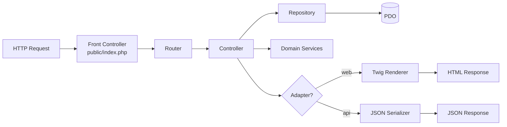

# Design Document

## Overview

This design specifies a full rewrite of phpDivingLog into a modern, decoupled PHP 8.3+
application. The system is split into three layers assembled from one repository:

1. **Core** — a framework-agnostic, PDO-based, PSR-4 Composer package (`PhpDivingLog\`)
   that owns all data access (repositories over the existing Diving Log MySQL schema),
   domain models, and cross-cutting services (unit conversion, formatting, localization,
   RTF→HTML, media-path resolution). The core knows nothing about HTTP, HTML, WordPress,
   or any framework.
2. **Standalone web adapter** — a thin front controller + router that maps requests to
   controllers, calls core repositories/services, and renders **Twig** templates. This is
   the feature-parity replacement for the current `*.php` entry points + Smarty.
3. **JSON API adapter** — a second thin adapter exposing the same core data as JSON for
   external consumers (a future WordPress shortcode shim consumes this; the shim itself is
   out of scope here).

The existing Diving Log schema is treated as **read-only**; no schema migration is
performed. All measurement conversion, coordinate/date formatting, and language handling is
preserved. Legacy front-end libraries (jQuery, DataTables, Highslide, jqPlot) and RTFClass
are replaced with modern, maintained equivalents and vanilla JS.

```mermaid
graph TD
    subgraph Delivery Adapters
        WEB[Standalone Web Adapter<br/>Router + Controllers + Twig]
        API[JSON API Adapter<br/>Router + JSON Controllers]
        WPSHIM[WordPress Shim<br/>OUT OF SCOPE]
    end
    subgraph Core Package "PhpDivingLog\ (PDO, PSR-4, zero framework)"
        SVC[Services<br/>UnitConverter, Formatter,<br/>RtfConverter, MediaResolver,<br/>Translator]
        REPO[Repositories<br/>Dive, DiveSite, Country, City,<br/>Shop, Trip, Equipment, Stats,<br/>Picture, Buddy, Tank, AppInfo]
        MODEL[Domain Models / DTOs]
        DB[(PDO Connection)]
    end
    MYSQL[(Diving Log MySQL<br/>read-only)]

    WEB --> REPO
    WEB --> SVC
    API --> REPO
    API --> SVC
    WPSHIM -. HTTP .-> API
    REPO --> MODEL
    REPO --> DB
    DB --> MYSQL
    SVC --> MODEL
```

## Steering Document Alignment

### Technical Standards (tech.md)
- **Removes the documented technical debt** in `tech.md`: the monolithic `classes.inc.php`
  is decomposed into one repository/model per entity; the WordPress `wpdb` layer is replaced
  with PDO; near-duplicate vendored files (`imgd.php`/`imgp.php`, Smarty, jqPlot, Highslide,
  RTFClass) are dropped.
- **Keeps config-driven behavior** (tech.md decision log): units, formats, prefixes, paths,
  and feature toggles remain configuration, moved to an env-based mechanism.
- **Preserves dual URL modes** (tech.md compatibility): the router supports pretty URLs via
  rewrite and a query-string fallback for hosts without mod_rewrite.
- **Preserves metric storage / display-time conversion** and externalized-query philosophy
  (queries live in repository classes as named, parameterized statements — the modern
  equivalent of the `sql/` files).

### Project Structure (structure.md)
- Replaces the "grouped by type at repo root" layout with a modern layered layout while
  keeping the spirit of separation (logic vs. queries vs. views vs. config):
  - `src/` (core, PSR-4) replaces `classes.inc.php` + `sql/`.
  - `templates/` (Twig) replaces `tpl/` (Smarty).
  - `public/` front controllers replace root `*.php` entry points.
  - `config/` + `.env` replace `config.inc.php` / `settings.php`.
- Naming modernized to PSR-12: `PascalCase` classes (kept), `camelCase` methods (replacing
  the legacy `snake_case` methods), one class per file.

## Code Reuse Analysis

### Existing Components to Leverage
- **`sql/*.sql` query semantics**: The SQL logic (joins, filters, aggregates) is reused as
  the basis for parameterized repository queries. Example mappings observed in the codebase:
  - `onedive.sql` → `DiveRepository::findByNumber(int $number)`
  - `divelist.sql` / `divelocations.sql` → `DiveRepository::listNumbers()` / `listByPlace()`
  - `buddies.sql` → `BuddyRepository::findByIds(int[] $ids)`
  - `divepics.sql` → `PictureRepository::findByLogId(int $logId)`
  - `onetrip.sql` (Trip⨝Country⨝Shop) → `TripRepository::findById(int $id)`
  - `divestats.sql` → `StatsRepository::aggregate()`
  - `dbinfo.sql` / `personal.sql` / `userdefined.sql` → `AppInfoRepository` / `PersonalRepository` / `UserDefinedRepository`
  - **Critical fix**: legacy queries interpolate `'$globals[divenr]'` directly into SQL
    (injection risk). Every ported query becomes a prepared statement with bound parameters.
- **Legacy conversion/formatting logic** in `classes.inc.php` and `includes/misc.inc.php`
  (unit conversion, coord/date formatting, decimal separators) is reused as the behavioral
  spec for the new `UnitConverter` and `Formatter` services — re-implemented cleanly, not
  copied.
- **Language files** (`includes/languages/*.inc.php`) are reused as the source of UI strings,
  loaded by a new `Translator` service (format may be normalized, e.g. to arrays/PHP files).
- **Template markup** in `tpl/*.tpl` is reused as the reference for the Twig templates’
  structure and information architecture (overview/detail split, header/footer/nav fragments).

### Integration Points
- **Diving Log MySQL schema (read-only)**: Repositories connect via PDO and query the
  existing tables — `Logbook`, `Buddy`, `Pictures`, `Equipment`, `Trip`, `Country`, `City`,
  `Shop`, `Personal`, `Userdefined`, `Tank`, `DBInfo` — honoring the configured
  `table_prefix` for single/multi-user modes.
- **Media directories**: Existing image conventions (`images/pictures`, `.../thumb`,
  `images/maps`, `images/equipment`, `images/flags`) are honored by a `MediaResolver`
  service that maps DB-stored filenames to safe web paths and generates thumbnails.

## Architecture

The architecture is a strict **layered / hexagonal** design: adapters depend on the core;
the core depends on nothing but PHP + PDO + a minimal set of Composer libraries. Data flows
inward (adapters → repositories/services → models); presentation flows outward (models →
Twig / JSON).

### Modular Design Principles
- **Single File Responsibility**: one repository per entity, one service per concern, one
  controller per resource, one Twig template per view fragment.
- **Component Isolation**: repositories never render; controllers never issue SQL; templates
  never contain business logic.
- **Service Layer Separation**: data access (repositories), domain services (conversion,
  formatting, RTF, media, i18n), and presentation (Twig / JSON) are distinct layers.
- **Utility Modularity**: conversion, formatting, and localization are separate injectable
  services reusable by both adapters.



### Directory Layout (target)

```
phpDivinglog/
├── composer.json                 # PSR-4 autoload, PHP >=8.3, scripts (test, stan, cs)
├── .env.example                  # documented config (replaces config.inc.php.example)
├── config/
│   └── config.php                # typed config loader (reads env)
├── src/                          # CORE (namespace PhpDivingLog\)
│   ├── Database/
│   │   └── Connection.php         # PDO factory
│   ├── Support/
│   │   ├── Config.php             # typed config access
│   │   ├── UnitConverter.php      # metric<->imperial
│   │   ├── Formatter.php          # dates, coords, decimals
│   │   ├── RtfConverter.php       # RTF -> sanitized HTML
│   │   ├── HtmlSanitizer.php      # wraps sanitizer lib
│   │   ├── MediaResolver.php      # safe media paths + thumbnails
│   │   └── Translator.php         # language strings
│   ├── Model/                     # DTOs: Dive, DiveSite, Country, City, Shop, Trip,
│   │   └── *.php                  #        Equipment, Buddy, Picture, Tank, Stats, AppInfo
│   └── Repository/                # one per entity, PDO + prepared statements
│       └── *Repository.php
├── adapters/
│   ├── web/                       # standalone HTML app
│   │   ├── Controller/*.php
│   │   └── bootstrap.php
│   └── api/                       # JSON API
│       └── Controller/*.php
├── public/
│   ├── index.php                  # web front controller
│   ├── api.php                    # api front controller (or /api route)
│   └── assets/                    # compiled/minified vanilla JS + CSS + modern libs
├── templates/                     # Twig (replaces tpl/)
│   ├── layout.html.twig
│   ├── partials/
│   └── <view>.html.twig
├── resources/lang/                # normalized language files
├── var/                           # writable: cache/ (twig, thumbs), log/
├── tests/                         # PHPUnit + fixtures
└── docs/                          # deployment (nginx/apache), API shape, WP-shim guide
```

## Components and Interfaces

### Core: Database\Connection
- **Purpose:** Build and hold a single configured PDO instance.
- **Interfaces:** `Connection::fromConfig(Config $c): PDO` — returns PDO with
  `ERRMODE_EXCEPTION`, `FETCH_ASSOC` default, `emulate_prepares=false`, utf8mb4.
- **Dependencies:** PDO (pdo_mysql/mysqlnd), `Config`.
- **Reuses:** DB credentials semantics from `config.inc.php`.

### Core: Repository\* (per entity)
- **Purpose:** All SQL for one entity; returns typed models. Examples:
  `DiveRepository`, `DiveSiteRepository`, `CountryRepository`, `CityRepository`,
  `ShopRepository`, `TripRepository`, `EquipmentRepository`, `BuddyRepository`,
  `PictureRepository`, `TankRepository`, `StatsRepository`, `UserDefinedRepository`,
  `PersonalRepository`, `AppInfoRepository`.
- **Interfaces (representative):**
  - `DiveRepository::findByNumber(int $n): ?Dive`
  - `DiveRepository::listNumbers(int $limit, int $offset): int[]`
  - `DiveRepository::listByPlace(int $placeId): Dive[]`
  - `BuddyRepository::findByIds(int[] $ids): Buddy[]`
  - `TripRepository::findById(int $id): ?Trip` (Trip⨝Country⨝Shop)
  - `StatsRepository::aggregate(): Stats`
- **Dependencies:** PDO, `Config` (for `table_prefix`).
- **Reuses:** The `sql/*.sql` query logic, re-expressed as prepared statements. Table names
  are composed from a validated prefix (allow-list `^[A-Za-z0-9_]*$`) since prefixes cannot
  be bound as parameters.

### Core: Support\UnitConverter
- **Purpose:** Convert depth, pressure, weight, temperature, volume metric↔imperial.
- **Interfaces:** `toDisplayLength/pressure/weight/temp/volume(float): float`, unit labels.
- **Dependencies:** `Config` (per-measure conversion flags).
- **Reuses:** Legacy conversion constants/behavior from `classes.inc.php`.

### Core: Support\Formatter
- **Purpose:** Format dates, coordinates (`d`/`dm`/`dms`), and decimal separators.
- **Interfaces:** `date(DateTimeInterface,string $fmt)`, `coord(float,string $mode)`,
  `decimal(float)`.
- **Dependencies:** `Config` (date format, coord format, decimal separator).

### Core: Support\RtfConverter + HtmlSanitizer
- **Purpose:** Convert Diving Log RTF comment fields to **sanitized** HTML.
- **Interfaces:** `RtfConverter::toHtml(string $rtf): string` (already sanitized).
- **Dependencies:** a maintained RTF-parsing package (or a small tested converter) plus an
  HTML sanitizer library (e.g. HTML Purifier or a maintained equivalent).
- **Reuses:** RTFClass behavior as the reference; output must be XSS-safe.

### Core: Support\MediaResolver
- **Purpose:** Map DB-stored filenames to safe web/file paths and provide thumbnails.
- **Interfaces:** `pictureUrl(string $file)`, `thumbUrl(string $file)`, `mapUrl`, `flagUrl`,
  `equipmentUrl`; all reject traversal outside configured media roots.
- **Dependencies:** `Config` (media paths, thumb dimensions), an image library (GD/Imagick)
  for thumbnail generation.

### Core: Support\Translator
- **Purpose:** Provide UI strings for the configured language.
- **Interfaces:** `get(string $key, array $params = []): string`.
- **Dependencies:** normalized language resources in `resources/lang/`.

### Web Adapter: Router + Controllers + TwigRenderer
- **Purpose:** Map HTTP requests to controllers, call core, render Twig.
- **Interfaces:** `DiveController::detail(int $number)`, `::overview()`;
  `DiveSiteController`, `CountryController`, `CityController`, `ShopController`,
  `TripController`, `EquipmentController`, `StatsController`, `GalleryController`,
  `SummaryController`, `ProfileController` (renders dive-profile data for the chart).
- **Dependencies:** core repositories/services, Twig, a small PSR-friendly router.
- **Reuses:** the request-type branching (`overview` vs `detail`) from legacy entry points;
  routing supports both pretty URLs and `?id=&user=` query-string fallback.

### API Adapter: JSON Controllers
- **Purpose:** Return the same data as JSON; reuse the exact repositories/services.
- **Interfaces:** `GET /api/dives`, `/api/dives/{number}`, `/api/sites`, `/api/sites/{id}`,
  `/api/countries`, `/api/cities`, `/api/shops`, `/api/trips`, `/api/trips/{id}`,
  `/api/equipment`, `/api/stats`. Errors return `{ "error": { code, message } }`.
- **Dependencies:** core, a JSON serializer for models.

### Front-end assets (replacing legacy JS)
- **Sortable/paged tables**: a maintained lightweight library (e.g. a modern grid/table lib)
  or native `<table>` + small vanilla-JS sorter — no jQuery/DataTables.
- **Dive profile chart**: a maintained charting library (e.g. Chart.js or uPlot) — no jqPlot.
  A `ProfileController`/endpoint supplies the depth/time series as JSON.
- **Image lightbox**: native `<dialog>` + CSS or a tiny maintained lightbox — no Highslide.
- **Delivery**: assets served from `public/assets/`; a documented, optional build step
  (npm) can bundle/minify, but the app must run without a Node runtime at request time.

## Data Models

Models are read-only DTOs hydrated by repositories from Diving Log tables. Only
representative fields are shown; repositories map raw column names to typed properties.

### Dive (from `{prefix}Logbook`)
```
- number: int            (Number — primary key used in URLs)
- logId: int             (LogID — links pictures/userdefined)
- placeId: int           (PlaceID — links dive site)
- date: DateTimeImmutable (Divedate/Divetime)
- depthMax: float        (Depth, metric)
- durationMin: int       (Divetime)
- waterTemp: ?float / airTemp: ?float
- buddies: int[]         (parsed buddy id list)
- gas/o2, ppO2, tanks, conditions, comments(rtf), userDefined[]
```

### DiveSite / Country / City / Shop
```
DiveSite (Logbook place data): placeId, place, country, city, coords(lat/lon), mapImage
Country ({prefix}Country): id, country, flag
City    ({prefix}City):    id, city, countryId
Shop    ({prefix}Shop):    id, shopName, shopType, countryId
```

### Trip (from `{prefix}Trip` ⨝ Country ⨝ Shop)
```
- id: int
- country: ?string        (joined c.Country)
- shopName: ?string       (joined s.ShopName)
- shopType: ?string
- dates, title, dives: int[]
```

### Equipment ({prefix}Equipment), Buddy ({prefix}Buddy), Picture ({prefix}Pictures)
```
Equipment: id, object, manufacturer, purchaseDate, serviceDue?, photo?
Buddy:     id, firstName, lastName
Picture:   path, description, logId
```

### Stats (aggregate from `{prefix}Logbook`)
```
- diveDateMin/Max, diveTimeMin/Max/Avg, bottomTimeSum
- depthMin/Max/Avg, waterTempMin/Max/Avg, airTempMin/Max/Avg, diveCount
```

### AppInfo ({prefix}DBInfo) / Personal ({prefix}Personal)
```
AppInfo: prgName, dbVersion (+ app name/version from config)
Personal: single-row diver profile (name, certs, medical, photo) subject to display toggles
```

## Error Handling

### Error Scenarios
1. **Missing/invalid configuration at startup**
   - **Handling:** `Config` validates required keys (DB DSN/credentials); throws a typed
     `ConfigException`; front controller catches and shows a generic setup error; details
     logged to `var/log`.
   - **User Impact:** Clear "application not configured" page; no secrets shown.
2. **Database connection or query failure**
   - **Handling:** PDO in exception mode; repositories let exceptions bubble to a central
     handler that logs and returns a 500 (HTML) or JSON error; SQL/credentials never
     surfaced.
   - **User Impact:** Generic error page / `{ "error": ... }`; details server-side only.
3. **Unknown resource (bad dive number / id / route)**
   - **Handling:** Repository returns `null`; controller returns 404 (HTML not-found page or
     JSON 404 error).
   - **User Impact:** Friendly not-found page or structured JSON 404.
4. **Unsafe media path / missing image**
   - **Handling:** `MediaResolver` rejects paths escaping configured roots; missing files
     fall back to the configured "missing image" asset.
   - **User Impact:** Placeholder image; no path disclosure.
5. **Malformed RTF / untrusted comment content**
   - **Handling:** `RtfConverter` degrades to plain text on parse failure; all output passes
     the HTML sanitizer.
   - **User Impact:** Readable (possibly unformatted) comment; never active/injected content.
6. **Host without mod_rewrite**
   - **Handling:** Router detects and supports query-string routing fallback.
   - **User Impact:** App works with `?`-style URLs.

## Testing Strategy

### Unit Testing
- **Framework:** PHPUnit, invoked via a Composer script.
- **Targets:** `UnitConverter` (all five measures, both directions, edge values),
  `Formatter` (coord `d`/`dm`/`dms`, date formats, decimal separator), `RtfConverter`
  (formatting + sanitization of hostile input), `MediaResolver` (path-traversal rejection),
  `Translator` (key lookup + fallback), prefix validation/allow-list.
- Pure logic tests require no database.

### Integration Testing
- **DB fixtures:** A seeded MySQL (or SQLite-compatible) fixture schema mirroring the Diving
  Log tables used by repositories, loaded before tests — no dependency on a live Diving Log
  export.
- **Targets:** each repository method (correct rows, prefix honored, joins for Trip, empty/
  not-found returns null), verifying prepared statements bind parameters.

### End-to-End Testing
- **Approach:** HTTP-level smoke tests against the front controllers for each view
  (dive detail, each overview/detail, stats, gallery, summary) asserting 200 + key content,
  plus 404 for unknown ids and a JSON-shape assertion per API endpoint.
- **Quality gates:** PHPStan/Psalm at an agreed level and PHP_CodeSniffer (PSR-12), both run
  as Composer scripts alongside PHPUnit; all three documented as the CI-equivalent commands.
