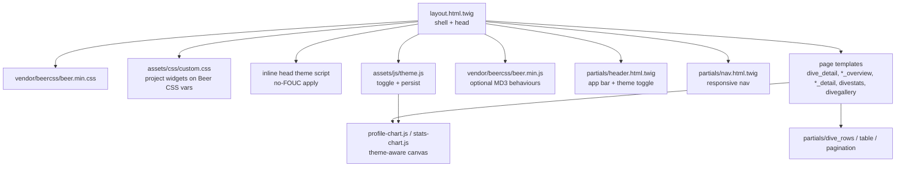

# Design Document

## Overview

This design re-skins the phpDivingLog **web adapter** (Twig templates + `public/assets`)
onto **Beer CSS** (Material Design 3), adds a persistent light/dark theme, and retires the
bespoke `app.css` — without touching domain code, repositories, controllers, routing, or
data.

The approach is deliberately **incremental and presentation-only**:
1. Vendor Beer CSS and its icon/typography assets locally under `public/`.
2. Rework the shared shell (`layout.html.twig` + `header`/`nav`/`footer` partials) to the
   Beer CSS main layout, and add a no-FOUC theme mechanism.
3. Introduce a slim project-specific override stylesheet (`custom.css`) built on Beer CSS
   CSS variables so project widgets (dive hero, logbook list, tank cards, gallery, chart
   legends) theme automatically.
4. Restyle each page template, one at a time, keeping the site shippable after every step.
5. Make the canvas charts (dive profile, statistics) theme-aware.

## Steering Document Alignment

### Technical Standards (tech.md)
The committed `tech.md`/`product.md` steering describes the **pre-migration** stack
(Smarty/wpdb/jqPlot). The live web adapter is already the modernized architecture
(PSR-4 `PhpDivingLog\*`, PDO, Twig, no Smarty). This design targets the **actual current**
architecture and advances the steering's stated **"modernize the presentation layer"** goal.
It upholds the enduring standards that still apply:
- **Host-friendliness / copy-to-deploy**: Beer CSS needs no build step; assets are vendored
  and served from the app origin — no CDN, no package installer at deploy time.
- **No prohibited legacy deps**: Smarty, wp-db.php, jqPlot, and legacy root controllers are
  not reintroduced.
- **Read-only presentation**: no data, schema, or data-access changes.

### Project Structure (structure.md)
- Templates stay under `templates/`; shared markup stays in `templates/partials/`.
- Front-end assets stay under `public/assets/` (served by nginx `root .../public`).
- Vendored third-party assets go under `public/assets/vendor/beercss/` (new), consistent
  with the "vendored dependencies" convention.
- New app-owned front-end files: `public/assets/css/custom.css` and
  `public/assets/js/theme.js`.

## Code Reuse Analysis

### Existing Components to Leverage
- **`templates/layout.html.twig`**: The single shell that every page extends — the one place
  to wire Beer CSS, the theme script, and the responsive nav.
- **`templates/partials/{header,nav,footer}.html.twig`**: Restyled once; every page inherits.
- **`templates/partials/{dive_rows,table,pagination}.html.twig`**: Shared row/table/pager
  markup — restyle once to Beer CSS table/list conventions, all consumers benefit.
- **`public/assets/js/tables.js`**: Keep its logbook-centering + sortable/clickable-row
  logic; only its target markup may change. Selectors (`[data-logbook-pane]`,
  `[data-logbook-list]`, `.logbook-item.is-active`, `data-sortable`, `data-href`) are the
  contract to preserve.
- **`public/assets/js/lightbox.js`**: Keep; it drives a native `<dialog>` overlay
  independent of the framework.
- **`public/assets/js/profile-chart.js`, `stats-chart.js`**: Keep the canvas rendering;
  extend to read theme-aware colors and redraw on theme change.
- **`tools/build-assets.mjs`**: Optional asset-copy step; extend to also copy the vendored
  Beer CSS folder if that convention is used (not required at runtime).

### Integration Points
- **Twig rendering (`adapters/web/TwigRenderer.php`)**: Unchanged — templates still render
  the same variables; only markup/classes change.
- **Static asset serving (`public/`)**: New vendored + custom assets are referenced by
  `layout.html.twig` via `/assets/...` URLs.
- **HTTP smoke tests (`tests/Http/WebSmokeTest.php`)**: Assert on markup contracts
  (`data-logbook-pane`, `data-logbook-list`, `data-logbook-link`); preserve these hooks so
  tests stay green.

## Architecture

Presentation is layered as: **vendored framework → project overrides → per-page templates**,
with a small **client-side theme controller** as the only stateful piece.

### Modular Design Principles
- **Single File Responsibility**: `beer.min.css` (framework), `custom.css` (project widgets),
  `theme.js` (theme state) are separate and single-purpose.
- **Component Isolation**: Page-specific markup lives in its own template; cross-page markup
  lives in partials.
- **Service Layer Separation**: No server-side logic added; theme state is client-only.
- **Utility Modularity**: Chart theming is a small shared helper consumed by both chart JS
  files.



## Components and Interfaces

### Vendored Beer CSS assets
- **Purpose:** Provide the MD3 framework locally.
- **Location:** `public/assets/vendor/beercss/` — `beer.min.css`, `beer.min.js`, and
  `material-dynamic-colors.min.js`; plus vendored icon font (Material Symbols) and base
  typography so the app works fully **offline**.
- **Interfaces:** Beer CSS "Settings/Elements/Helpers" classes and the `class="light|dark"`
  document setting.
- **Reuses:** Nothing existing; new vendored dependency.

### `layout.html.twig` (shell)
- **Purpose:** Wire the framework, theme, and responsive layout once.
- **Interfaces / changes:**
  - `<head>`: `<link>` to `beer.min.css` then `custom.css`; a small **inline** theme script
    that applies the stored/`prefers-color-scheme` theme to `<body>`/`<html>` **before first
    paint**; `<script defer>` for `beer.min.js` and `theme.js`.
  - `<body class="{light|dark}">` with the Beer CSS main layout (`<nav>` + single `<main>`).
- **Dependencies:** header/nav/footer partials.
- **Reuses:** Existing block structure (``) and title variable.

### Theme controller — `theme.js` + inline head script
- **Purpose:** Own theme state (the single contract between framework and app).
- **Interfaces:**
  - Storage key: `divelog:theme` = `"light" | "dark"`.
  - Inline head script: on load, resolve theme = stored value ?? OS `prefers-color-scheme`,
    set the body/html class synchronously (no-FOUC).
  - `theme.js`: bind the header toggle to flip the class, persist the choice, update the
    toggle's `aria-pressed`/label, and dispatch a `themechange` event.
- **Dependencies:** `localStorage`, `matchMedia`.
- **Reuses:** None; new.

### Header + nav partials
- **Purpose:** MD3 app bar with brand + theme toggle; responsive primary navigation.
- **Interfaces:**
  - `header.html.twig`: brand + an accessible theme-toggle `<button>` (icon + label,
    `aria-pressed`).
  - `nav.html.twig`: same seven links (Dives, Sites, Countries, Trips, Equipment, Stats,
    API) expressed as a Beer CSS responsive nav (persistent on desktop, compact/bottom on
    mobile), with the active route marked.
- **Dependencies:** Beer CSS nav classes + Material Symbols icons.
- **Reuses:** Existing link set and routes (unchanged URLs).

### `custom.css` (project overrides)
- **Purpose:** Style project-specific widgets Beer CSS doesn't provide, using **Beer CSS CSS
  variables** so they follow the active theme automatically.
- **Scope:** dive hero/metric grid, logbook list/items (`.logbook-item.is-active`), tank
  cards, gallery grid, lightbox dialog, chart legend text, entity detail grids.
- **Dependencies:** Beer CSS variable names / surface tokens.
- **Reuses:** Salvage layout intent from the current `app.css`; drop rules Beer CSS replaces.

### Page templates (restyled incrementally)
- **Purpose:** Present the same data with Beer CSS elements (cards, tables, chips, badges).
- **Set (12 groups):** `layout`+partials; `dive_detail`; `dives_overview`;
  `divesite_overview`/`divesite_detail`; `divecountry_overview`/`divecountry_detail`;
  `divecity_overview`/`divecity_detail`; `diveshop_overview`/`diveshop_detail`;
  `divetrip_overview`/`divetrip_detail`; `equipment_overview`/`equipment_detail`;
  `divestats`; `divegallery`; `divesummary` (special-cased, see below).
- **Reuses:** `dive_rows`, `table`, `pagination` partials.

### Theme-aware charts — `profile-chart.js`, `stats-chart.js`
- **Purpose:** Keep canvas charts legible in both themes.
- **Interfaces:** Read colors from CSS variables (or a `data-theme`/body-class check) at draw
  time; listen for the `themechange` event to redraw.
- **Reuses:** Existing rendering logic; add a tiny shared `chartTheme()` helper.

## Data Models

No persistent/server data models are added (presentation-only). The only stateful contract:

### Theme preference (client-side)
```
divelog:theme (localStorage)
- value: "light" | "dark"
- default: resolved from prefers-color-scheme when unset
- applied as: <body class="light|dark"> before first paint
```

## Error Handling

### Error Scenarios
1. **JavaScript disabled**
   - **Handling:** Inline theme resolution is JS-based, but CSS provides a sane default theme
     via `beer.min.css`; all content, links, and layout render server-side.
   - **User Impact:** Fully readable page in the default theme; toggle simply absent/no-op.

2. **Vendored asset missing / 404 (bad deploy)**
   - **Handling:** `layout.html.twig` references stable local paths; a missing framework CSS
     degrades to unstyled-but-functional HTML. Document the required vendored file set.
   - **User Impact:** Unstyled but usable page; no crash (no server-side dependency).

3. **Flash of wrong theme (FOUC)**
   - **Handling:** Theme class is applied by a synchronous inline `<head>` script before the
     body renders.
   - **User Impact:** No light→dark flash on load for dark-preference users.

4. **Chart illegible in one theme**
   - **Handling:** Charts read theme-aware colors and redraw on `themechange`.
   - **User Impact:** Profile/stats charts remain readable in both themes.

5. **Embeddable summary clobbering host page**
   - **Handling:** `divesummary.html.twig` is meant to be embedded in an external page; it is
     kept lightweight and is **not** forced into the full Beer CSS shell/theme (or is scoped)
     so it doesn't override a host site's styles.
   - **User Impact:** Embeds continue to work without visual conflicts.

## Testing Strategy

### Unit Testing
- No new PHP units required (presentation-only). Existing `composer stan` and `composer cs`
  must stay green.

### Integration Testing
- **HTTP smoke tests (`tests/Http/WebSmokeTest.php`)**: keep passing. Preserve the asserted
  markup hooks (`data-logbook-*`); update assertions only where a markup contract
  intentionally changes, and add an assertion that Beer CSS + theme assets are referenced.
- Run the full gate after each page: `composer test && composer stan && composer cs`.

### End-to-End Testing (manual visual checklist per page)
- Page renders in **light** and **dark**; toggling persists across navigation and reload;
  no FOUC for dark preference.
- Dive detail: logbook list still centers the selected dive; profile chart legible in both
  themes.
- Overviews: sortable headers and clickable rows still work; pagination intact.
- Gallery: thumbnails + lightbox overlay still work.
- Stats: pie/depth charts legible in both themes.
- Mobile viewport: responsive nav usable, no horizontal overflow; keyboard reachable toggle
  and links.
- JS-disabled: content and links intact in default theme.
