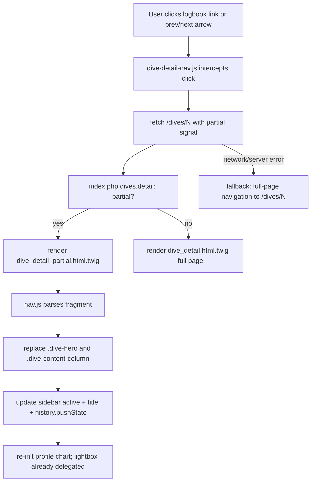

# Design Document

## Overview

This feature turns dive-to-dive navigation on the detail page into seamless in-place content
swapping. Clicking a Logbook sidebar entry or a prev/next arrow fetches only the dive detail
fragment and swaps it into the current page, preserving both the window scroll position and the
sidebar's own scroll — no full reload, no jump, no flicker. The address bar, page title, sidebar
active state, and prev/next arrows always reflect the shown dive, and every URL stays a real,
refresh-safe, shareable address. It is a progressive-enhancement layer: with JavaScript disabled,
the existing full-page navigation is unchanged.

The approach reuses the existing `DiveController::detail()` view-model and the existing detail
markup unchanged. The only structural change is factoring the detail body into a shared Twig
partial so the same markup can be served either wrapped in the full page shell or as a bare
fragment.

## Steering Document Alignment

### Technical Standards (tech.md)

- **No SPA framework, no build step**: The client logic is one small dependency-free vanilla-JS
  module under `public/assets/js/`, consistent with the existing theme/chart/table/lightbox scripts.
- **Server-rendered, read-only**: The partial response reuses the same `DiveController::detail()`
  path and Twig rendering; no new SQL, no schema writes, output stays Twig auto-escaped.
- **Both URL modes**: Works with pretty URLs and query-string mode because the client targets the
  canonical dive URL already produced by the templates.
- **Theme-aware**: Re-initialized charts read the current palette via the existing
  `DivlogChartTheme` helper and keep responding to `themechange`.

### Project Structure (structure.md)

- **Front controller stays thin**: `public/index.php` gains a single partial-vs-full branch for the
  existing `dives.detail` route.
- **Views**: The detail body moves into `templates/partials/dive_detail_content.html.twig`;
  `dive_detail.html.twig` includes it (full page), and a new
  `dive_detail_partial.html.twig` includes it (bare fragment). No duplicated markup.
- **Assets**: New `public/assets/js/dive-detail-nav.js`; `profile-chart.js` refactored to expose an
  idempotent init entry point.

## Code Reuse Analysis

### Existing Components to Leverage

- **`DiveController::detail(int $number)`**: Returns the complete detail view-model already; reused
  verbatim for both full and partial responses.
- **`TwigRenderer`**: Renders the fragment template the same way it renders full pages.
- **`Router` `dives.detail`**: Unchanged; the partial decision is made in the front controller from
  a request signal, not a new route.
- **`lightbox.js`**: Already uses document-level click delegation and resolves the image group at
  open time, so swapped-in pictures work with no re-init.
- **`tables.js` logbook logic**: The sidebar DOM is preserved across swaps, so its scroll state is
  untouched; only the active class is moved by the new module.
- **`chart-theme.js` (`DivlogChartTheme`)**: Reused by the re-initialized profile chart.

### Integration Points

- **`public/index.php` dispatch**: The `dives.detail` branch chooses the fragment template when the
  request is a partial; otherwise it renders the full page exactly as today.
- **Existing detail markup**: Extracted into a shared partial with no behavioral change.

## Architecture

The design is a classic progressive-enhancement "PJAX"-style swap, scoped to two regions:

- Swap region A: the hero (`.dive-hero`) — carries the title line and the prev/next arrows.
- Swap region B: the main content column (`.dive-content-column`) — profile chart, comments,
  tanks, pictures, and the details panel.
- Preserved region: the Logbook sidebar (`.dive-logbook-column`) — kept in the DOM so its scroll
  position never resets; only its active item is updated.

Event handling uses **document-level delegation**, so it keeps working after the swappable regions
are replaced without re-binding.

### Modular Design Principles

- **Single File Responsibility**: `dive-detail-nav.js` owns only fetch+swap+history; the partial
  template owns only fragment markup; the controller/front controller own only the partial decision.
- **Component Isolation**: The profile chart gains a clean idempotent init entry point instead of a
  fire-once IIFE.
- **No duplication**: One shared content partial feeds both the full page and the fragment.



## Components and Interfaces

### Component 1 — Shared content partial (`templates/partials/dive_detail_content.html.twig`)

- **Purpose:** Hold the detail body (hero + layout grid with sidebar + content column) currently in
  `dive_detail.html.twig`'s content block, so it can be rendered inside the shell or standalone.
- **Interfaces:** Consumes the existing `DiveController::detail()` view-model keys unchanged.
- **Dependencies:** None new.
- **Reuses:** The exact current markup, moved (not rewritten).

### Component 2 — Full page template (`templates/dive_detail.html.twig`)

- **Purpose:** Extends `layout.html.twig`, includes the content partial, and keeps the script tags.
- **Interfaces:** Same as today.
- **Dependencies:** `dive_detail_content.html.twig`, `dive-detail-nav.js` (added), existing scripts.
- **Reuses:** Existing layout and script includes.

### Component 3 — Partial template (`templates/dive_detail_partial.html.twig`)

- **Purpose:** Render only the content partial (no shell, nav, or footer) for AJAX swaps.
- **Interfaces:** Same view-model as the full page. Exposes the data the client needs to update
  chrome via a small set of `data-*` attributes on the fragment root (dive number and page title).
- **Dependencies:** `dive_detail_content.html.twig`.
- **Reuses:** The shared content partial.

### Component 4 — Front-controller partial branch (`public/index.php`)

- **Purpose:** For `dives.detail`, detect a partial request and render the fragment template;
  otherwise render the full page. Not-found handling is shared for both.
- **Interfaces:** Partial signal = request header `X-Requested-With: XMLHttpRequest` (primary) with
  an `?partial=1` query fallback.
- **Dependencies:** `TwigRenderer`, `DiveController`.
- **Reuses:** The existing `detail()` call and 404 branch.

### Component 5 — Client navigation module (`public/assets/js/dive-detail-nav.js`)

- **Purpose:** Intercept in-app dive navigation, perform the fetch+swap, and manage history/title.
- **Interfaces (internal):**
  - Delegated `click` handler for `[data-logbook-link]` and `.dive-sequence-nav a[href]`.
  - `popstate` handler to swap when the user goes back/forward.
  - `swapTo(url, pushHistory)` — fetch fragment, replace regions, update chrome, re-init chart.
- **Dependencies:** `window.DivelogProfileChart.init` (added), the partial endpoint.
- **Reuses:** Document-delegated lightbox (no coupling needed).
- **Behavior details:**
  - Only intercept same-origin `/dives/{number}` links; ignore modified clicks (ctrl/cmd/middle),
    downloads, and external links, letting the browser handle them normally.
  - Preserve `window.scrollY` and the sidebar `scrollTop` across the swap (no reset).
  - Move `.is-active` / `aria-current` to the newly selected sidebar item; if the selected item is
    off-screen in the sidebar it is left where it is (no forced recenter) to honor scroll stability.
  - On any fetch/parse error, fall back to `window.location.assign(url)` (full navigation).

### Component 6 — Profile chart init entry point (`public/assets/js/profile-chart.js`)

- **Purpose:** Replace the fire-once IIFE with an idempotent initializer callable after a swap.
- **Interfaces:** `window.DivelogProfileChart.init(root = document)` — finds `#profile-chart` within
  `root`, renders it, and wires `themechange`; safe to call repeatedly (tears down/redraws for the
  current canvas). Auto-runs once on `DOMContentLoaded` for the initial page.
- **Dependencies:** `DivlogChartTheme`, `/profile/{number}` JSON endpoint (unchanged).
- **Reuses:** All existing chart-drawing code.

## Data Models

No persistent data models change. One transient client shape:

### Swap request/response

```
Request:  GET /dives/{number}
          Header X-Requested-With: XMLHttpRequest   (or ?partial=1)
Response: 200 text/html  -> detail fragment only (hero + layout grid)
          404 text/plain -> "Dive not found" (same as full-page 404)
```

### Fragment root data attributes (client contract)

```
element:   the fragment root wrapping the detail body
- data-dive-number: integer   (the shown dive's number)
- data-dive-title:  string     (page title to set on document.title)
```

## Error Handling

### Error Scenarios

1. **AJAX fetch fails (network offline, 5xx):**
   - **Handling:** Catch the error and `window.location.assign(targetUrl)` to perform a normal
     full-page navigation.
   - **User Impact:** Falls back to the current (working) behavior; never a broken/blank panel.

2. **Partial requested for a non-existent dive:**
   - **Handling:** Front controller returns the same 404 path as full-page detail; the client treats
     a non-200 as an error and falls back to full navigation (which shows the standard 404).
   - **User Impact:** Consistent not-found behavior.

3. **JavaScript disabled/unavailable:**
   - **Handling:** No interception occurs; anchors navigate normally.
   - **User Impact:** Identical to today — full-page navigation, correct content.

4. **Back/forward to a dive not previously swapped (e.g. deep link then back):**
   - **Handling:** `popstate` triggers a fresh partial fetch for the URL; on error, full navigation.
   - **User Impact:** Correct dive shown; address bar consistent.

## Testing Strategy

### Unit Testing

- No new repository/controller logic to unit test (the view-model is reused). PHPStan/PHPCS must
  stay green for the front-controller branch and templates.

### Integration Testing (HTTP smoke, `tests/Http/WebSmokeTest.php`)

- `testDiveDetailPartialReturnsFragmentOnly`: GET `/dives/1` with `X-Requested-With: XMLHttpRequest`
  returns 200, contains the hero and `.dive-content-column`, contains the fragment root
  `data-dive-number`, and does NOT contain the page shell markers (no `<!doctype html>`, no primary
  nav, no footer).
- `testDiveDetailFullStillRenders`: GET `/dives/1` without the header returns the full page as today
  (existing assertions remain green) and includes `/assets/js/dive-detail-nav.js`.
- `testDiveDetailPartialNotFound`: partial request for a missing dive returns 404.
- The `request()` helper is extended to allow optional request headers so the partial can be
  exercised.

### End-to-End Testing (manual browser checklist)

- Click through the sidebar: content swaps, window scroll and sidebar scroll are preserved, active
  item updates, URL + title update, no flicker.
- Prev/next arrows swap in place and update their own targets/disabled state.
- Browser Back/Forward restores the right dive in place.
- Refresh and direct deep-link render the full page.
- Profile chart renders for each swapped dive and respects light/dark theme.
- Pictures lightbox works on the swapped dive; grouped prev/next still correct.
- With JS disabled, navigation still works as full page loads.
- Superseded artifact: remove the earlier window-scroll-restore workaround in `tables.js` (commit
  `3b753c1`) since seamless swapping replaces it; verify no regression to the sidebar's own scroll
  persistence.
