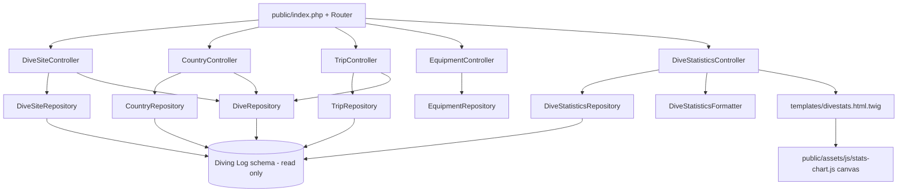

# Design Document

## Overview

This design adds entity overviews with dive-count context, cross-links between the
dive logbook and its supporting entities (Sites, Countries, Trips, Equipment,
Shops/Cities where present), and a full Dive Statistics page with a depth-range
pie chart — all within the existing PDO/Twig architecture.

The work is additive and follows the established layering:

- **Repositories** (`src/Repository/*`) — read-only PDO queries, column/value
  variant resilience.
- **Support services** (`src/Support/*`) — `UnitConverter`, `Formatter`, plus a new
  statistics classifier for percentage/label formatting.
- **Web controllers** (`adapters/web/Controller/*`) — assemble typed view arrays.
- **Twig templates** (`templates/*`) — presentation, Twig auto-escaping.
- **Front controller** (`public/index.php`) + `Router` — routing (already supports
  the needed routes).
- **Canvas JS** (`public/assets/js/*`) — pie chart, mirroring the profile-chart
  approach (no jqPlot / no chart library).

## Steering Document Alignment

### Technical Standards (AGENTS.md)

- No Smarty / wp-db.php / jqPlot / legacy controllers introduced.
- Repositories remain **read-only** (SELECT only), using bound PDO parameters and
  the validated `TABLE_PREFIX` via `sprintf('%sLogbook', $this->tablePrefix)`.
- Env-based config via `Config`; PDO via `Database/Connection`.
- Verification: `composer test && composer stan && composer cs` must pass.

### Project Structure

- New model DTOs in `src/Model/`, repositories in `src/Repository/`, formatting
  service in `src/Support/`, controllers in `adapters/web/Controller/`, wiring in
  `adapters/web/bootstrap.php`, templates in `templates/`, chart JS in
  `public/assets/js/`.

## Code Reuse Analysis

### Existing Components to Leverage

- **`DiveRepository::listByPlace()`** — the proven pattern for listing dives for an
  entity; new list-by-trip / list-by-country methods mirror it, but return the
  compact overview shape (`number,date_time,depth,duration,location`) already used
  by `listOverview()` to keep detail pages light.
- **`DiveRepository::listOverview()` compact row shape** — reused for every
  entity's "dives at this X" list so templates share one row partial.
- **Column/value variant helpers** (`firstNonEmptyString`, `firstNumeric`,
  SQLSTATE `42S22` try/catch in `TripRepository`/`EquipmentRepository`) — reused for
  statistics classification resilience.
- **`UnitConverter` / `Formatter`** — depth/temperature/time/date formatting so
  metric/imperial and decimal-separator settings are honored.
- **`MediaResolver`** — flag/equipment/photo URLs (absolute web paths).
- **`profile-chart.js` canvas patterns** — DPR-aware sizing, drawing primitives,
  and legend rendering reused for the new pie chart.
- **Clickable-row behavior in `tables.js`** — reused via `data-href` on entity and
  dive rows.

### Integration Points

- **Router** already maps `/sites`, `/countries`, `/trips`, `/equipment`, `/stats`
  (overview) and `/{resource}/{id}` (detail). No routing changes required beyond
  optionally an inline stats depth-distribution being embedded (no new route).
- **`bootstrap.php`** — inject the new statistics repository/service and pass the
  `DiveRepository` into the site/country/trip controllers.
- **Diving Log schema** — read-only against `Logbook`, `Place`, `Country`, `Trip`,
  `Equipment` (+ `City`, `Shop`).

## Architecture



### Modular Design Principles

- **Single File Responsibility**: statistics querying (`DiveStatisticsRepository`)
  is separate from statistics formatting (`DiveStatisticsFormatter`), which is
  separate from view assembly (`DiveStatisticsController`).
- **Component Isolation**: dive-listing-by-entity is a small set of focused
  `DiveRepository` methods; each returns the shared compact row shape.
- **Service Layer Separation**: no SQL and no business logic in Twig; percentages
  and labels computed in PHP.

## Components and Interfaces

### DiveRepository (extended)

- **Purpose:** provide compact dive lists for entity detail pages.
- **Interfaces (new):**
  - `listOverviewByPlace(int $placeId, int $limit = 500): array` — compact rows.
  - `listOverviewByTrip(int $tripId, int $limit = 500): array` — filters `TripID`.
  - `listOverviewByCountry(int $countryId, int $limit = 500): array` — filters
    `CountryID` (denormalized column) with a `Place`-join fallback when absent.
  - `countByColumn(string $column, int $id): int` — internal-safe grouped count
    used by overviews (or dedicated `countByPlace`, etc.).
- **Dependencies:** PDO, table prefix.
- **Reuses:** existing compact row mapping from `listOverview()`; SQLSTATE
  try/catch for optional `CountryID`/`TripID` columns.

### DiveSiteRepository / CountryRepository (extended)

- **Purpose:** list entities with a per-entity dive count in one grouped query
  (avoid N+1).
- **Interfaces (new):**
  - `listWithDiveCounts(int $limit = 500): array` — `LEFT JOIN Logbook` grouped by
    the entity id, returning entity fields + `DiveCount`.
- **Dependencies:** PDO, table prefix.
- **Reuses:** existing `mapSite` / `mapCountry` mapping; SQLSTATE fallback to a
  countless list if the join column is missing.

### DiveStatisticsRepository (new)

- **Purpose:** compute all aggregate and classification figures with a small,
  fixed number of read-only queries.
- **Interfaces:**
  - `compute(): DiveStatistics` — returns the populated DTO.
- **Internal helpers:**
  - `aggregateRow(): array` — one query for MIN/MAX/AVG/SUM over `Logbook`
    (Divedate, Divetime, Depth, Watertemp, Airtemp) + `COUNT(*)`.
  - `diveNumberFor(string $column, string|float $value): ?int` — resolves the
    dive number for an extreme (first match; last match for "last dive").
  - `countWhere(string $whereSql, array $params = []): ?int` — one classification
    count; returns `null` when the referenced column is absent (SQLSTATE `42S22`),
    so the statistic is omitted rather than fatal.
  - `depthBuckets(): array` — five counts by the legacy metric boundaries.
- **Dependencies:** PDO, table prefix.
- **Reuses:** variant/SQLSTATE resilience patterns.
- **Classification (legacy-faithful):**
  - Shore `Entry = 1`, Boat `Entry = 2`.
  - `Divetype` comma-list match for codes 3=Night, 4=Drift, 5=Deep, 6=Cave,
    7=Wreck, 8=Photo using the four positional `LIKE` variants
    (`= 'c'`, `LIKE 'c,%'`, `LIKE '%,c,%'`, `LIKE '%,c'`).
  - Water `Water = 1/2/3` → Salt/Fresh/Brackish.
  - Supply `SupplyType = 0/1/2` → OC/SCR/CCR.
  - `Deco = 'True'`, `Rep = 'True'`, `DblTank = 'True'/'False'`.
  - No-deco = `total - deco`; Non-rep = `total - rep`.
  - Depth buckets: `Depth <= 18`, `>18 AND <=30`, `>30 AND <=40`,
    `>40 AND <=55`, `>55`.

### DiveStatisticsFormatter (new, `src/Support`)

- **Purpose:** turn raw counts/values into display strings.
- **Interfaces:**
  - `percentageLabel(int $count, int $total): string` — `"N (P%)"` with
    `round(count/total*100)`.
  - `depth(float $meters): string`, `temperature(?float $c): string`,
    `duration(int $minutes): string`, `bottomTime(int $minutes): string` (hh:mm).
- **Dependencies:** `UnitConverter`, `Formatter`.
- **Reuses:** existing converters for unit fidelity.

### DiveStatisticsController (new)

- **Purpose:** assemble the statistics view payload, including pie-chart data.
- **Interfaces:** `view(): array` — returns formatted aggregates, classification
  labels, dive-number links, and a `depth_distribution` array
  (`[{label, count, percent}]`) plus a JSON-serializable payload for the canvas.
- **Dependencies:** `DiveStatisticsRepository`, `DiveStatisticsFormatter`,
  `UnitConverter`.
- **Reuses:** existing controller conventions. Replaces the current thin
  `StatsController::view()` for the `/stats` route; the minimal `StatsRepository`
  and `SummaryController` embed remain untouched.

### Entity controllers (extended)

- **DiveSiteController::detail** — add `dives` (compact rows) via
  `DiveRepository::listOverviewByPlace`.
- **CountryController::detail** — add `sites` and/or `dives`.
- **TripController::detail** — add `dives` via `listOverviewByTrip`.
- **EquipmentController::detail** — unchanged linkage unless a dive-equipment join
  exists in-schema; if absent, omit the section (no error).
- **Overview methods** — include `diveCount` per row from `listWithDiveCounts`.

### Templates

- `templates/partials/dive_rows.html.twig` (new) — shared compact dive-row list
  used by site/country/trip detail pages, each row `data-href="/dives/{number}"`.
- `divesite_detail.html.twig`, `divecountry_detail.html.twig`,
  `divetrip_detail.html.twig` — include the dive list + empty state.
- `divesite_overview.html.twig`, `divecountry_overview.html.twig`,
  `divetrip_overview.html.twig`, `equipment_overview.html.twig` — show dive counts
  and clickable rows.
- `divestats.html.twig` — full statistics layout + `<canvas>` for the pie chart,
  with bucket data in a `data-*`/JSON script tag.
- `dive_detail.html.twig` — already links site/shop/trip; ensure country link is
  present where an id exists.

### Canvas chart

- `public/assets/js/stats-chart.js` (new) — reads bucket JSON from the page, draws
  a labeled pie with a legend on `<canvas>`, DPR-aware, no external libraries.

## Data Models

### DiveStatistics (new readonly DTO, `src/Model`)

```
DiveStatistics
- totalDives: int
- firstDive: {date: ?DateTimeImmutable, number: ?int}
- lastDive: {date: ?DateTimeImmutable, number: ?int}
- totalBottomTimeMinutes: ?int
- diveTime: {min: ?int, minNumber: ?int, max: ?int, maxNumber: ?int, avg: ?float}
- depth: {min: ?float, minNumber: ?int, max: ?float, maxNumber: ?int, avg: ?float}
- waterTemp: {min: ?float, minNumber: ?int, max: ?float, maxNumber: ?int, avg: ?float}
- airTemp: {min: ?float, minNumber: ?int, max: ?float, maxNumber: ?int, avg: ?float}
- classifications: array<string,int|null>   // keyed: shore, boat, night, drift,
    deep, cave, wreck, photo, salt, fresh, brackish, deco, nodeco, rep, norep,
    single, twin, oc, scr, ccr
- depthBuckets: list<int>                     // [b0_18,b19_30,b31_40,b41_55,b55p]
```

Nested value groups may be modeled as small readonly value objects or typed
arrays; phpstan-friendly typed arrays are acceptable to match existing style.

### Compact dive row (existing shape, reused)

```
{ number:int, date_time:DateTimeImmutable, depth:float, duration:int, location:string }
```

## Error Handling

### Error Scenarios

1. **Missing classification column in the connected DB** (e.g. no `Divetype`).
   - **Handling:** `countWhere()` catches SQLSTATE `42S22` (and MySQL "no such
     column") and returns `null`; the controller omits or zeroes that stat.
   - **User Impact:** the page renders; unsupported metrics are simply absent.

2. **Entity has no dives.**
   - **Handling:** detail controllers pass an empty list; template shows an
     empty-state message.
   - **User Impact:** clear "no dives" message, no broken table.

3. **Empty database (totalDives = 0).**
   - **Handling:** percentage helper guards divide-by-zero (returns `0 (0%)`);
     pie chart renders an empty/neutral state.
   - **User Impact:** stats page shows zeros, no error.

4. **Missing media (flag/equipment photo).**
   - **Handling:** `MediaResolver` returns the missing-image placeholder or the
     value is omitted.
   - **User Impact:** placeholder or no image.

## Testing Strategy

### Unit Testing

- `DiveStatisticsFormatter`: percentage rounding, `N (P%)` formatting,
  divide-by-zero, bottom-time hh:mm, unit conversion honoring config.
- `DiveStatisticsRepository`: against the SQLite fixture — aggregates, depth-bucket
  boundaries (edge values 18/19/30/31/40/41/55/56), classification counts, and
  graceful `null` when a column is absent (extend the fixture with the needed
  columns and a second stripped-down table scenario).
- `DiveRepository`: `listOverviewByPlace/Trip/Country` return correct compact rows
  and respect the id filter and ordering.

### Integration Testing

- `WebSmokeTest`: `/stats` renders the aggregates, classification labels, the
  `<canvas>` hook, and the bucket JSON; `/sites/{id}`, `/trips/{id}`,
  `/countries/{id}` render the dive list with `/dives/{number}` links and the
  empty-state when appropriate; overviews show dive counts and clickable rows.

### End-to-End Testing

- Manual: from `/sites` → a site → a dive → back; verify statistics figures against
  a known export and the pie chart proportions.
