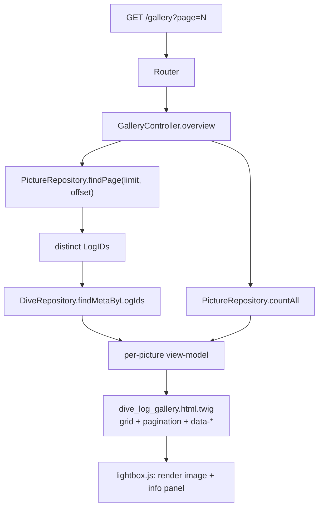

# Design Document

## Overview

Add a new **Dive Log Gallery** page at `/gallery` that renders a paginated grid of thumbnails for
**all** dive pictures in the logbook. Each thumbnail is a lightbox trigger carrying its dive's
metadata as `data-*` attributes. The shared lightbox (already grouped/navigable) is extended to
render, alongside the photo, an information block:

```
Dive 202 by <diver>
Location: Japan, Okinawa | Divesite: Nakayukui | When: 22.08.2024 14:00 | view dive
```

The feature reuses the existing layered architecture: a controller action builds a view-model,
new read-only repository methods provide paginated data + bounded metadata resolution, a Twig
template renders the grid + pagination, and the shared `lightbox.js` gains an info panel driven by
markup data attributes. No new runtime dependency is introduced.

## Steering Document Alignment

### Technical Standards (tech.md)
- **Layered, framework-light**: new logic lands in the established layers — `Repository/` (read-only
  PDO, `SELECT *`, validated `TABLE_PREFIX`), `Controller/*` (view-model assembly), Twig template,
  and vanilla `public/assets/js`. No bundler, no CDN.
- **Read-only, schema-agnostic**: new repository methods keep the `SELECT *` + defensive column
  aliasing style already used across repositories; metadata is resolved from the `Logbook` row's
  inline `Place`/`City`/`Country` and `PlaceID`/`CountryID` with repository fallback.
- **Metric storage / display-time formatting**: dates/times are rendered via the existing
  `Formatter` and `H:i` formatting already used by the dive overview.
- **Vanilla JS lightbox**: extends the same dependency-free component shipped in the previous spec.

### Project Structure (structure.md)
- New files/edits stay in canonical locations: `src/Repository/`, `adapters/web/Controller/`,
  `templates/`, `templates/partials/`, `public/assets/js/`, `public/assets/css/`, and `tests/Http/`.
- Routing changes live in the existing `Router` + `public/index.php` dispatch, matching how every
  other route is wired.

## Code Reuse Analysis

### Existing Components to Leverage
- **`GalleryController`**: Extended with an `overview()` action (keeps the existing `forDive()`).
- **`PictureRepository`**: Extended with `countAll()` and `findPage()` (keeps `findByLogId()`).
- **`DiveRepository`**: Extended with a batch metadata lookup by `LogID` set; reuses the existing
  `mapDateTime()` and inline `Place/City/Country` extraction already present.
- **`MediaResolver`** (`thumbUrl`/`pictureUrl`): unchanged; used for thumbnails and full images.
- **`Formatter`**: reused for the date portion of "When"; time via `->format('H:i')`.
- **`PersonalRepository::getProfile()`**: reused for the diver display name (same source as the site
  title in `public/index.php`).
- **Shared `lightbox.js` + `.gallery-grid` + `data-lightbox`/`data-lightbox-group`**: reused; the
  gallery is one navigation group.
- **`partials/pagination.html.twig`**: generalized with an optional `basePath` (default `/`) so it
  serves both the dives overview and the gallery.

### Integration Points
- **Router / front controller**: `/gallery` (and `?type=gallery`) resolve to a new
  `gallery.overview` route rendered with a new template.
- **Primary nav** (`partials/nav.html.twig`): a new "Gallery" link.
- **Diving Log schema**: `Pictures` (paged) joined logically to `Logbook` (metadata) via `LogID`.

## Architecture

Request → Router resolves `gallery.overview` → `GalleryController::overview(page, perPage)` →
`PictureRepository::countAll()` + `findPage()` → collect distinct `LogID`s →
`DiveRepository::findMetaByLogIds()` (one query) → assemble per-picture view-model (thumb, full URL,
description, dive number, diver, location, site, when, dive URL) → Twig renders grid + pagination →
client `lightbox.js` reads `data-*` on click and renders the info panel.

### Modular Design Principles
- **Single File Responsibility**: repository = data access; controller = view-model; template =
  markup; lightbox = overlay behavior.
- **Bounded queries**: one count query, one page query, one metadata query per page — no per-photo
  N+1.
- **Template-agnostic lightbox**: metadata flows through `data-*` attributes; the JS never knows
  about dives.



## Components and Interfaces

### Component 1: `PictureRepository` (extended)
- **Purpose:** Paginated, cross-dive picture access.
- **Interfaces:**
  - `countAll(): int` — `SELECT COUNT(*) FROM {prefix}Pictures`.
  - `findPage(int $limit, int $offset): list<Picture>` — `SELECT * FROM {prefix}Pictures
    ORDER BY LogID DESC, PictureID DESC LIMIT :limit OFFSET :offset` (newest dives first; stable).
- **Dependencies:** PDO, table prefix.
- **Reuses:** Existing `Picture` mapping shape and defensive column handling.

### Component 2: `DiveRepository` (extended)
- **Purpose:** Bounded metadata resolution for a page's pictures.
- **Interfaces:**
  - `findMetaByLogIds(list<int> $logIds): array<int, array{number:int, date_time:DateTimeImmutable,
    place_id:int, country_id:?int, place_name:?string, city_name:?string, country_name:?string}>`
    — single `SELECT * FROM {prefix}Logbook WHERE LogID IN (...)`, keyed by `LogID`.
- **Dependencies:** PDO, table prefix.
- **Reuses:** `mapDateTime()` and the same inline `Place/City/Country` extraction used by
  `mapOverviewRow()`/`findByNumber()`.
- **Notes:** Empty input returns `[]` without querying. Falls back gracefully when optional name
  columns are absent (schema-agnostic).

### Component 3: `GalleryController::overview()` (new action)
- **Purpose:** Build the paginated gallery view-model with per-photo metadata.
- **Interfaces:**
  - `overview(int $page = 1, int $perPage = 24): array{pictures:list<array<string,mixed>>,
    currentPage:int, pages:int, total:int}`
- **Behavior:**
  - `total = pictures.countAll()`, `pages = max(1, ceil(total/perPage))`, clamp `page` into range.
  - `pictures.findPage(perPage, offset)`; collect distinct `logId`s; `dives.findMetaByLogIds(...)`.
  - Diver name = trimmed `firstName + ' ' + lastName` from `personal.getProfile()`; empty ⇒ omitted.
  - `location` = country/city composition (to match the example "Japan, Okinawa"); `site` =
    place/site name; `when = formatter.formatDate(dateTime) + ' ' + dateTime.format('H:i')`;
    `diveUrl = '/dives/' + number`.
  - Missing values become empty strings (template/JS omit them).
- **Dependencies (constructor, extended):** `PictureRepository`, `MediaResolver`, `DiveRepository`,
  `PersonalRepository`, `Formatter` (plus `DiveSiteRepository`/`CountryRepository`/`CityRepository`
  only if inline names are insufficient — used as fallback).
- **Reuses:** `MediaResolver`, `Formatter`, existing profile lookup.

### Component 4: `dive_log_gallery.html.twig` (new template)
- **Purpose:** Render the grid, pagination, and empty state.
- **Structure:** `.gallery-grid` `<ul>` with `data-lightbox-group="dive-log-gallery"`; each `<li>`
  anchor carries:
  ```
  <a href="{{ picture.url }}" data-lightbox
     data-dive-number="{{ picture.diveNumber }}"
     data-diver="{{ picture.diver }}"
     data-location="{{ picture.location }}"
     data-site="{{ picture.site }}"
     data-when="{{ picture.when }}"
     data-dive-url="{{ picture.diveUrl }}">
    
  </a>
  ```
  Pagination via `partials/pagination.html.twig` with `basePath: '/gallery'`; empty-state message
  when `pictures` is empty; includes `/assets/js/lightbox.js`.
- **Reuses:** `.gallery-grid` styles, shared lightbox, layout/nav.

### Component 5: `partials/pagination.html.twig` (generalized)
- **Purpose:** Serve both the dives overview and the gallery.
- **Change:** Accept optional `basePath` (default `/`); links become
  `{{ basePath }}?page={{ page }}...`. Existing `dives_overview` calls stay valid (default `/`).

### Component 6: `lightbox.js` (extended) + styles
- **Purpose:** Render a dive-info panel + "view dive" link for gallery photos.
- **Interfaces (internal):** In `renderCurrentImage()`, read `data-dive-number`, `data-diver`,
  `data-location`, `data-site`, `data-when`, `data-dive-url` from the current anchor and populate a
  new info panel:
  - Line 1: `Dive <number>` + (` by <diver>` when diver present).
  - Line 2: `Location: <location>`, `Divesite: <site>`, `When: <when>` (each part omitted when
    empty), joined by ` | `, followed by a `view dive` anchor (`href = data-dive-url`) when present.
  - Panel is hidden when `data-dive-number` is absent (backward compatible with other galleries).
  - All values assigned via `textContent` / `setAttribute('href', ...)` — no `innerHTML` injection.
- **Markup added to the dialog:** `<div class="lightbox-info" data-lightbox-info hidden>` containing
  a title element and a meta line with a `data-lightbox-viewdive` anchor.
- **Styles:** `.lightbox-info`, `.lightbox-info-title`, `.lightbox-info-meta`, and the view-dive
  link, using existing theme custom properties (light/dark aware).

## Data Models

Client info-panel model (derived per render from the anchor's `data-*`):
```
GalleryPhotoInfo
- diveNumber: string
- diver:      string   // omitted when empty
- location:   string   // omitted when empty
- site:       string   // omitted when empty
- when:       string   // "22.08.2024 14:00"
- diveUrl:    string   // "/dives/202"
```

Server per-picture view-model (Twig):
```
GalleryPicture
- thumb:       string  // MediaResolver.thumbUrl
- url:         string  // MediaResolver.pictureUrl (full image)
- description: ?string // Picture.description (alt)
- diveNumber:  int
- diver:       string
- location:    string
- site:        string
- when:        string
- diveUrl:     string
```

## Error Handling

### Error Scenarios
1. **No pictures in the logbook.**
   - **Handling:** `countAll()` = 0 ⇒ `pages` = 1, `pictures` = []; template renders empty state.
   - **User Impact:** Friendly "no photos yet" message, no broken grid.
2. **Out-of-range / non-numeric `page`.**
   - **Handling:** Non-numeric ⇒ 1; clamp into `[1, pages]`.
   - **User Impact:** Always lands on a valid page.
3. **Picture references a missing/unknown dive (`LogID` not in Logbook).**
   - **Handling:** Metadata map has no entry ⇒ metadata fields empty; thumbnail still shows; info
     panel shows only what's available (or hides the number if absent).
   - **User Impact:** Photo remains browsable; no error.
4. **Partial metadata (no site / city / country / profile name).**
   - **Handling:** Empty parts omitted from the composed strings; diver `by` omitted when no name.
   - **User Impact:** Clean, gap-free info line.
5. **Missing image file.**
   - **Handling:** `MediaResolver` already returns the configured "missing" placeholder.
   - **User Impact:** Placeholder thumbnail; no crash.

## Testing Strategy

Same reality as the prior spec: PHPUnit (repositories + HTTP smoke) with no JS runner; JS verified
by inspection + manual browser checks.

### Unit Testing
- **Repository tests** (fixture-backed, `pdo_sqlite`): `PictureRepository::countAll()` returns the
  seeded count; `findPage()` honors limit/offset and ordering; `DiveRepository::findMetaByLogIds()`
  returns correct `number`/date/name fields for a set of `LogID`s and `[]` for empty input.

### Integration Testing (PHP HTTP smoke)
- New `testGalleryOverviewRenders`: `GET /gallery` ⇒ 200; body contains "Dive Log Gallery", a
  `.gallery-grid` with `data-lightbox-group="dive-log-gallery"`, at least one `data-dive-number`
  and `data-dive-url="/dives/..."`, and the `/assets/js/lightbox.js` script tag.
- Nav assertion: primary nav includes a `/gallery` link.
- Confirm `/gallery/{id}` (per-dive) still resolves (existing behavior unchanged).
- Run the gate: `composer test && composer stan && composer cs`.

### End-to-End Testing (manual, per acceptance criteria)
- Browse `/gallery`, paginate; open a photo → info panel shows the two-line block with correct
  dive number, diver, location, site, when, and a working "view dive" link.
- Next/previous in the lightbox updates image **and** info panel **and** the view-dive link.
- Single/absent-metadata photos degrade cleanly; light/dark themes both legible.
