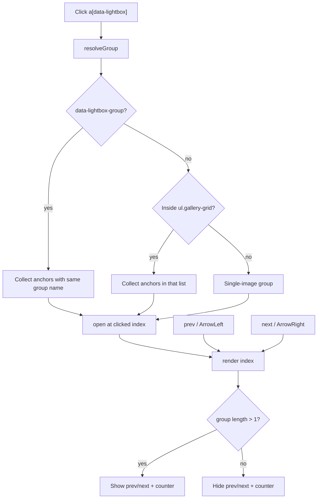

# Design Document

## Overview

This feature upgrades the shared, dependency-free lightbox component
(`public/assets/js/lightbox.js`) from a single-image viewer into a **grouped gallery
browser** with next/previous controls, keyboard navigation, wrap-around, and a position
indicator. The dive detail page (`templates/dive_detail.html.twig`) is the primary target,
but because the same component and the same `a[data-lightbox]` trigger convention are reused
by the dive-site, gallery, and certification/stats pages, all of them benefit from one
change to the shared module.

The core design problem is **grouping**: a single page may contain several independent
galleries (e.g. the stats page renders one `gallery-grid` list per certification, and the
dive-site page has a standalone map image plus a photo gallery). Navigation must be confined
to the gallery the user opened. The design solves this purely on the client by resolving a
group from the clicked trigger's DOM context, so existing templates need little or no change
and future galleries opt in automatically.

## Steering Document Alignment

### Technical Standards (tech.md)
- Keeps the front end **dependency-free vanilla JS**, consistent with the other files in
  `public/assets/js/` (theme controller, tables, profile chart, existing lightbox). No
  bundler, no new runtime dependency, no CDN — matching "Vendored front-end ... with no
  runtime CDN".
- Presentation-layer only: **no changes to repositories, models, or the read-only data
  model**. Image URLs and captions continue to originate from Twig (auto-escaped).
- Styling extends the existing Material Design 3 (Beer CSS) look using the CSS custom
  properties already used by `.lightbox-dialog` in `public/assets/css/custom.css`
  (`--surface-container-highest`, `--on-surface`), so it respects the light/dark theme.

### Project Structure (structure.md)
- Change footprint stays within established locations: JS in `public/assets/js/`, styles in
  `public/assets/css/custom.css`, and markup in `templates/*.html.twig`. No new directories
  or architectural layers are introduced.
- The trigger contract remains a small set of `data-*` attributes on markup, matching the
  existing convention (`data-lightbox`, `data-dive-number`, `data-logbook-list`, etc.).

## Code Reuse Analysis

### Existing Components to Leverage
- **`public/assets/js/lightbox.js`**: Extended in place. The existing single delegated
  `document` click listener and native `<dialog>` element (with its built-in Escape-to-close
  and focus trapping) are retained and built upon.
- **`.lightbox-dialog` styles (`public/assets/css/custom.css` ~lines 676–699)**: Reused;
  new control styles are added alongside using the same theme variables.
- **`a[data-lightbox]` trigger convention**: Already present in all four templates
  (`dive_detail`, `divesite_detail`, `divegallery`, `divestats`). No new trigger attribute
  is required for grouping to work; an optional explicit attribute is added for clarity.
- **`.gallery-grid` list wrapper**: Used as the default grouping boundary, so existing
  galleries group correctly with zero markup changes.

### Integration Points
- **Twig templates**: Provide the anchors (`href` = full image, nested `img@alt` =
  description). The dive detail gallery `<ul>` receives an optional explicit
  `data-lightbox-group` attribute to document the convention; other templates rely on the
  automatic `gallery-grid` fallback.
- **Native `<dialog>` API**: Continues to own modal semantics (backdrop, `showModal()`,
  Escape handling, focus containment).

## Architecture

The component is a single IIFE module with a small internal state machine. It resolves a
**group** (an ordered list of trigger anchors) from the clicked anchor, tracks the current
index, and re-renders the dialog contents on navigation. All image data is read from the DOM
already rendered by Twig — no network calls beyond fetching the already-referenced full
images.

### Modular Design Principles
- **Single File Responsibility**: All navigation, grouping, and rendering logic lives only
  in `lightbox.js`. Templates declare data; CSS declares appearance.
- **Component Isolation**: The dialog and its controls are created once and reused; no
  per-thumbnail handlers (preserves the current single delegated listener).
- **Graceful degradation**: Any missing element/attribute falls back to single-image
  behavior without throwing.

### Grouping resolution (precedence)

When a trigger is clicked, its group is resolved in this order:

1. **Explicit group** — nearest ancestor (or the anchor itself) with
   `data-lightbox-group="<name>"` → group = all `a[data-lightbox]` sharing that same value.
2. **Gallery fallback** — nearest ancestor `ul.gallery-grid` → group = all `a[data-lightbox]`
   within that list. (This makes existing galleries work unchanged, and correctly separates
   the stats page's per-certification lists.)
3. **Standalone** — none of the above → group = just the clicked anchor (single image; nav
   hidden). Covers the dive-site map image.



## Components and Interfaces

### Component 1: Lightbox module (`public/assets/js/lightbox.js`)
- **Purpose:** Own the dialog lifecycle, grouping, navigation, rendering, and keyboard input.
- **Interfaces (internal functions):**
  - `resolveGroup(anchor) -> HTMLAnchorElement[]` — apply the precedence above.
  - `open(anchor)` — resolve group, set `currentIndex` to the clicked anchor's position,
    `render()`, then `dialog.showModal()`.
  - `render(index)` — set image `src`/`alt`, caption text, counter text ("N / M"), and
    show/hide nav controls based on group length.
  - `next()` / `prev()` — advance/retreat `currentIndex` with wrap-around, then `render()`.
- **Dependencies:** DOM, native `<dialog>`; no external libs.
- **Reuses:** Existing delegated click listener and dialog element.

### Component 2: Dialog markup (built by the module at runtime)
- **Purpose:** Present the current image plus controls.
- **Structure:**
  ```html
  <dialog class="lightbox-dialog">
    <div class="lightbox-toolbar">
      <span class="lightbox-counter" data-lightbox-counter aria-live="polite"></span>
      <form method="dialog"><button class="lightbox-close" aria-label="Close">×</button></form>
    </div>
    <div class="lightbox-stage">
      <button type="button" class="lightbox-nav lightbox-prev"
              aria-label="Previous image" data-lightbox-prev>‹</button>
      
      <button type="button" class="lightbox-nav lightbox-next"
              aria-label="Next image" data-lightbox-next>›</button>
    </div>
    <p class="lightbox-caption" data-lightbox-caption></p>
  </dialog>
  ```
- **Dependencies:** Native `<dialog>` for modal/Escape/focus-trap.
- **Reuses:** `.lightbox-dialog` base styles.

### Component 3: Styles (`public/assets/css/custom.css`)
- **Purpose:** Style the toolbar, stage, nav buttons, counter, and caption in theme.
- **Interfaces:** New classes `.lightbox-toolbar`, `.lightbox-stage`, `.lightbox-nav`
  (`.lightbox-prev`/`.lightbox-next`), `.lightbox-counter`, `.lightbox-caption`, plus a
  hidden-state helper (e.g. `.lightbox-nav[hidden]`).
- **Reuses:** Existing `.lightbox-dialog` rules and theme custom properties.

### Component 4: Template convention (dive detail)
- **Purpose:** Document the explicit grouping contract on the primary page.
- **Change:** Add `data-lightbox-group="dive-pictures"` to the `<ul class="gallery-grid">`
  in `templates/dive_detail.html.twig`. Other templates are unchanged (they use the
  `gallery-grid` fallback), keeping the diff minimal.

## Data Models

This is client-only; no persisted models. The in-memory navigation state:

```
LightboxState
- group: HTMLAnchorElement[]   // ordered trigger anchors in the active group
- index: number               // current position within group

ImageView (derived per render, from the anchor)
- src:     string   // anchor.href (full-size image URL)
- alt:     string   // nested img.alt (falls back to "Preview")
- caption: string   // same as alt / optional data-caption; empty hides the caption line
```

## Error Handling

### Error Scenarios
1. **Single-image group (or standalone trigger).**
   - **Handling:** `render()` sets `hidden` on both nav buttons and clears/hides the counter.
   - **User Impact:** Lightbox behaves exactly as today — one image, close button only.
2. **Clicked anchor missing a nested `` or `alt`.**
   - **Handling:** `alt`/caption fall back to a default ("Preview"); caption line is hidden
     when empty.
   - **User Impact:** Image still displays; no broken/empty caption.
3. **Malformed/absent group attributes.**
   - **Handling:** Resolution cascades to the next tier; worst case is a standalone group.
     No exceptions are thrown; guards use optional chaining.
   - **User Impact:** Navigation may be limited to the single image but nothing breaks.
4. **Rapid navigation before an image finishes loading.**
   - **Handling:** `render()` always sets `src`/`alt` from the target index; the browser
     handles load cancellation. Optional adjacent-image preloading may be added for smoothness.
   - **User Impact:** Latest requested image wins; no stuck state.

## Testing Strategy

The project has **no JavaScript test harness** (PHPUnit covers PHP repositories and HTTP
smoke tests). Testing therefore combines automated PHP-level checks with manual browser
verification.

### Unit Testing
- Not applicable to the vanilla JS at the function level (no JS runner is configured, and
  adding one is out of scope). Logic is kept small and guard-heavy to stay verifiable by
  inspection.

### Integration Testing (PHP HTTP smoke)
- Extend/confirm the existing smoke tests so the dive detail page still renders successfully
  and includes the gallery markup and the `lightbox.js` script tag (guards against template
  regressions). Where a smoke test already asserts on `dive_detail` output, add an assertion
  that the gallery `<ul>` carries `data-lightbox-group` (or at least `gallery-grid`).
- Run the standard gate: `composer test && composer stan && composer cs` (JS/CSS are not
  linted by these, but template changes must keep PHP tests green).

### End-to-End Testing (manual, per acceptance criteria)
- **Dive detail, multi-photo:** open a thumbnail → prev/next cycle through only that dive's
  photos; counter updates; wrap-around at both ends; arrow keys work; Escape closes.
- **Single photo:** nav controls and counter are hidden.
- **Dive-site page:** map image opens standalone (no nav); the separate photo gallery
  navigates within itself only.
- **Stats/certifications:** opening a cert scan navigates only within that certification's
  front/back pair, not across other certifications.
- **Theme + accessibility:** controls are visible and labeled in both light and dark themes;
  focus stays within the dialog; controls are keyboard-operable.
