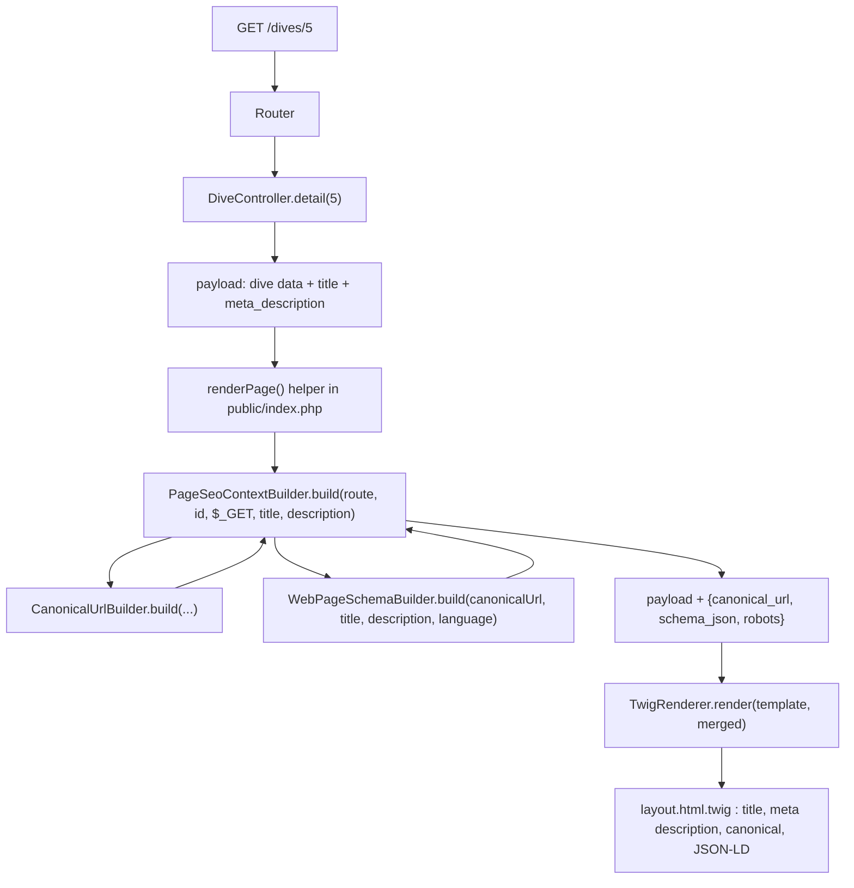

# Design Document

## Overview

Add per-page SEO metadata (unique `<title>`, `<meta name="description">`,
`<link rel="canonical">`, and a `schema.org` `WebPage` JSON-LD block) to every content page in
phpDivingLog. Domain-specific text (title, description) is computed by each controller from data
it already fetches — mirroring the existing, currently-unused `title` Twig variable. The
mechanical, cross-cutting parts (canonical URL construction across both routing modes, JSON-LD
encoding, the SEO opt-out, and the one hard-coded `noindex` for the embeddable summary view) are
centralized in three new `Support\Seo` classes invoked **once**, in `public/index.php`, right
before each `TwigRenderer::render()` call — so the 9 existing controllers each gain two small,
domain-specific fields, while the URL/schema mechanics live in one place and aren't duplicated
16 times.

## Steering Document Alignment

### Technical Standards (tech.md)
- **Layered, framework-light**: new logic lands in `src/Support/Seo/` (core, no HTTP/Twig
  knowledge) and a thin call in `public/index.php` (front controller stays "routing and
  rendering only" per `structure.md`). No new runtime dependency — JSON-LD uses PHP's built-in
  `json_encode`.
- **Config over code**: the public base URL and the SEO on/off flag are `.env` settings via the
  existing `Config` pattern, not hardcoded or per-template.
- **Read-only, schema-agnostic**: no repository changes; every field used for titles/descriptions
  is already returned by the existing `detail()`/`overview()` payloads.

### Project Structure (structure.md)
- New files live in a new `src/Support/Seo/` sub-namespace (`PhpDivingLog\Support\Seo`),
  consistent with `Support/`'s role as framework-agnostic core services.
- Changes to `adapters/web/Controller/*.php` are additive (two new array keys per payload) —
  controllers still emit no HTML and no SQL.
- `public/index.php` gains one small render helper; routing/dispatch logic is unchanged.

## Code Reuse Analysis

### Existing Components to Leverage
- **`Config`**: extended, not replaced — reuse the existing `APP_URL` / `appUrl()` slot
  (currently defined but never wired into Twig or used for URL-building) as the public base URL
  for canonical/schema construction; add one new key or `APP_SEO_ENABLED` / `seoEnabled()`.
- **`Router`**: the `overview`/`detail` resource→path-segment maps already defined inside
  `Router::resolve()` are extracted to a reusable constant so the new canonical URL builder
  doesn't duplicate them.
- **`layout.html.twig`**: already has the `title` variable and pattern (`title|default(...)`);
  extended with sibling variables (`meta_description`, `robots`, `canonical_url`, `schema_json`)
  rather than a new templating mechanism.
- **Controller payloads**: every controller already computes the display strings needed (dive
  `date_display`/`location_display`, site `max_depth_display`, etc.) — titles/descriptions reuse
  these, no new queries.
- **`TwigRenderer`**: unchanged; still just renders a template with a context array.

### Integration Points
- **`public/index.php`**: each of the ~16 `echo $renderer->render($template, $payload); return;`
  call sites is replaced with a call to a new local `renderPage()` helper that merges the SEO
  overrides before rendering.
- **`adapters/web/bootstrap.php`**: constructs the new `Support\Seo\*` services once and adds them
  to the container, alongside the existing `services` array.
- **`.env.example`**: documents the repurposed base-URL setting and the new opt-out flag.

## Architecture



Each controller stays responsible only for **what** the title/description say (domain
knowledge); `PageSeoContextBuilder` stays responsible only for **how** a route becomes a URL and
how that URL/title/description become a canonical tag and a schema block — a clean split that
avoids threading `Config`/URL-building into every one of the 9 controllers.

### Modular Design Principles
- **Single File Responsibility**: `CanonicalUrlBuilder` only builds URLs; `WebPageSchemaBuilder`
  only builds JSON-LD; `PageSeoContextBuilder` only decides which case applies (enabled / opted
  out / summary-noindex) and composes the other two.
- **Component Isolation**: none of the three new classes know about Twig, HTTP, or PDO.
- **Centralized cross-cutting concern**: URL/schema mechanics are computed once per request, not
  re-implemented per controller.

## Components and Interfaces

### Component 1: `Config` (extended)
- **Purpose:** Expose the public base URL and the SEO on/off flag.
- **Interfaces:** Existing `appUrl(): string` is repurposed (default value and `.env.example`
  docs updated to describe it as "the public, internet-facing URL of this deployment," not the
  GitHub project link). New: `seoEnabled(): bool` backed by `APP_SEO_ENABLED` (default `'true'`).
- **Dependencies:** None beyond existing `Config` machinery (`asBool`, `defaults()`).
- **Reuses:** Existing env-loading/validation pipeline; no new parsing logic.

### Component 2: `Router` (extended)
- **Purpose:** Make the route↔path-segment mapping reusable outside `resolve()`.
- **Interfaces:** Extract the existing inline `$overviewRoutes`/`$detailRoutes` arrays into a
  single `public const RESOURCE_SEGMENTS = ['dives' => 'dives', 'sites' => 'sites', ...]` (resource
  key, shared by both overview and detail paths since they use the same segment). `resolve()` is
  refactored to read from the constant instead of local arrays; behavior unchanged.
- **Dependencies:** None new.
- **Reuses:** Existing route table — single source of truth instead of two copies.

### Component 3: `Support\Seo\CanonicalUrlBuilder` (new)
- **Purpose:** Build the absolute canonical URL for a route, matching whichever routing mode
  (`APP_QUERY_STRING`) is actually active, or `null` if no base URL is configured.
- **Interface:** `build(string $route, ?int $id, int $page = 1): ?string`
- **Behavior:**
  - Returns `null` if `Config::appUrl()` is empty (Requirement 3.5).
  - Splits `$route` into `resource.kind` (e.g. `dives` / `overview`); looks up the path segment
    via `Router::RESOURCE_SEGMENTS`; returns `null` if unmapped (defensive — should not happen for
    the 9 wired routes).
  - **Query-string mode**: `{baseUrl}/?type={resource}` (+ `&id={id}` for detail, + `&page={page}`
    for overview when `$page > 1`).
  - **Path mode**: `{baseUrl}/` for `dives.overview` page 1 (the app's actual root route);
    `{baseUrl}/{segment}` for other overview routes or `dives.overview` beyond page 1;
    `{baseUrl}/{segment}/{id}` for detail routes; appends `?page={page}` when `$page > 1`
    (Requirement 3.4 — paginated pages self-canonicalize, never collapse to page 1).
  - Search (`q`) and sort params on `dives.overview` are deliberately **not** reflected in the
    canonical URL — those variations canonicalize to the plain (optionally paginated) listing,
    matching common SEO practice of not indexing every filter/sort permutation.
- **Dependencies:** `Config` (base URL, routing mode).
- **Reuses:** `Router::RESOURCE_SEGMENTS`.

### Component 4: `Support\Seo\WebPageSchemaBuilder` (new)
- **Purpose:** Build the `schema.org` `WebPage` JSON-LD payload as a safe-to-embed string.
- **Interface:** `build(string $canonicalUrl, string $title, ?string $description, string $language): string`
- **Behavior:**
  - Assembles `['@context' => 'https://schema.org', '@type' => 'WebPage', 'url' => $canonicalUrl,
    'name' => $title]`, adding `description` only when non-empty (Requirement 4.1).
  - Maps the app's configured language name (currently only `'english'`) to a BCP-47 tag (`'en'`)
    via a small internal table; omits `inLanguage` entirely for an unmapped value rather than
    guessing (Requirement 4.2, "SHOULD").
  - Encodes with `json_encode($data, JSON_HEX_TAG | JSON_HEX_AMP | JSON_HEX_APOS | JSON_HEX_QUOT |
    JSON_UNESCAPED_SLASHES)` so any user-authored text (site/dive names) embedded in title or
    description cannot prematurely close the `<script>` tag or inject markup (Requirement 4.3) —
    the result is rendered in Twig with `|raw` specifically *because* it is already
    safely hex-escaped, not because it's trusted input.
- **Dependencies:** None beyond PHP's `json_encode`.
- **Reuses:** Nothing new required; pure function of its inputs.

### Component 5: `Support\Seo\PageSeoContextBuilder` (new — orchestrator)
- **Purpose:** Decide which of three cases applies for a given request and return the array of
  overrides to merge into the controller's payload before rendering.
- **Interface:**
  `build(string $route, ?int $id, array $query, ?string $title, ?string $description): array`
- **Behavior (three cases):**
  1. **Global opt-out** (`Config::seoEnabled() === false`): returns
     `['title' => null, 'meta_description' => null, 'robots' => 'noindex,nofollow']`. Setting
     `title`/`meta_description` to `null` (not just omitting them) is required because
     `array_merge` must *overwrite* the controller's already-set values so Twig's
     `title|default(app_name|default(...))` fallback kicks back in (Requirement 6.1).
  2. **`summary.overview`** (embeddable widget, independent of the flag above): returns
     `['robots' => 'noindex,nofollow']` only — canonical/schema are skipped as not worth
     computing for a route that's always noindexed; existing title/description behavior for that
     route is untouched (Requirement 7.2).
  3. **Otherwise** (SEO enabled, real content route): reads `page` from `$query` (default 1,
     clamped to ≥ 1), calls `CanonicalUrlBuilder::build()`; if the result (or `$title`) is `null`,
     returns `[]` (page renders with no enhancement rather than a broken one); otherwise calls
     `WebPageSchemaBuilder::build()` and returns `['canonical_url' => ..., 'schema_json' => ...]`.
- **Dependencies:** `Config`, `CanonicalUrlBuilder`, `WebPageSchemaBuilder`.
- **Reuses:** The other two new components; no duplicate branching logic elsewhere.

### Component 6: `public/index.php` (extended — render helper)
- **Purpose:** Apply the SEO overrides uniformly without touching the 9 controllers' internals.
- **Change:** Introduce one local helper:
  ```php
  $renderPage = static function (string $template, array $payload, string $route, ?int $id) use ($renderer, $seoContextBuilder): string {
      $overrides = $seoContextBuilder->build($route, $id, $_GET, $payload['title'] ?? null, $payload['meta_description'] ?? null);
      return $renderer->render($template, array_merge($payload, $overrides));
  };
  ```
  Each existing `echo $renderer->render($template, $payload); return;` call site becomes
  `echo $renderPage($template, $payload, $match['route'], $match['id']); return;` — a mechanical,
  one-line change per route branch. `profile.detail` (JSON) and `not-found` (plain text) are left
  untouched (Requirement 7.3/7.4).
- **Dependencies:** `$seoContextBuilder` constructed once in `bootstrap.php`'s container.

### Component 7: Controllers (9 files — additive change)
- **Purpose:** Each `overview()`/`detail()` already returns a view-model array; each gains two new
  string keys computed from data already fetched: `title` and `meta_description`.
- **Representative examples** (exact copy is an implementation detail, not a design commitment):

  | Route | `title` | `meta_description` |
  |---|---|---|
  | `dives.overview` | `"All Dives"` (+ `" — Page N"` when `page > 1`) | `"Browse {N} logged dives."` |
  | `dives.detail` | `"Dive #{number} — {location_display} ({date_display})"` | Built from `date_display`, `location_display`, `depth_display`/`depth_label`, truncated via `DescriptionTruncator` |
  | `sites.detail` | `"{site.name} — Dive Site"` | From `max_depth_display`, `water_types_display`, dive count |
  | `countries.detail` / `cities.detail` / `shops.detail` / `trips.detail` | `"{name} — {Country|City|Shop|Trip}"` | From each controller's existing detail fields (dive count, location) |
  | `equipment.detail` | `"{equipment.name}"` | From equipment type/service-due fields already computed |
  | `stats.overview` | `"Dive Statistics"` | From existing aggregate counts |
  | `gallery.overview` | `"Dive Log Gallery"` (+ page suffix) | `"Browse {N} photos across the logbook."` |
  | `gallery.detail` | `"Photos — Dive #{number}"` | From the dive's site/date if available |
  | `summary.overview` | unchanged (no goal, Requirement 7) | unchanged |

- **Dependencies:** None new — no controller needs `Config` or the new `Seo` classes; that's the
  point of centralizing them in Component 5/6.
- **Reuses:** `Support\Seo\DescriptionTruncator` (Component 8) for any description built from
  free-form/long fields.

### Component 8: `Support\Seo\DescriptionTruncator` (new, small helper)
- **Purpose:** Enforce the ~155–160 character search-result-friendly length (Requirement 2.2).
- **Interface:** `truncate(string $text, int $maxLength = 155): string`
- **Behavior:** Returns `$text` unchanged if within the limit; otherwise cuts at the last word
  boundary before the limit and appends `…` — never mid-word, never with dangling punctuation.
- **Dependencies:** None.
- **Reuses:** Called from controllers wherever a description is composed from longer fields.

### Component 9: `layout.html.twig` (extended `<head>`)
- **Purpose:** Render the new optional metadata alongside the existing `<title>`.
- **Change:**
  ```twig
  <title>{{ title|default(app_name|default('phpDivingLog')) }}</title>
  
    <meta name="description" content="{{ meta_description }}">
  
  
    <meta name="robots" content="{{ robots }}">
  
  
    <link rel="canonical" href="{{ canonical_url }}">
  
  
    <script type="application/ld+json">{{ schema_json|raw }}</script>
  
  ```
- **Reuses:** The existing `title` variable/default pattern; no other templates need changes
  since all of them already ``.

## Data Models

### `PageSeoContext` (conceptual — `PageSeoContextBuilder::build()` return shape)
```
array{
  title?: string|null,            // present+null only when globally opted out
  meta_description?: string|null, // present+null only when globally opted out
  robots?: string,                // 'noindex,nofollow' when opted out or summary.overview
  canonical_url?: string,         // absolute URL, only when enabled and base URL configured
  schema_json?: string,           // pre-encoded JSON-LD, only alongside canonical_url
}
```

### `schema.org WebPage` (JSON-LD payload shape)
```
{
  "@context": "https://schema.org",
  "@type": "WebPage",
  "url": "https://example.com/dives/5",
  "name": "Dive #5 — Nakayukui, Okinawa (22.08.2024)",
  "description": "Dive #5 at Nakayukui, Okinawa on 22.08.2024. Max depth 18.2 m.",
  "inLanguage": "en"
}
```

## Error Handling

### Error Scenarios
1. **Public base URL not configured (`APP_URL` empty).**
   - **Handling:** `CanonicalUrlBuilder::build()` returns `null`; `PageSeoContextBuilder` returns
     `[]` for that route — no canonical tag, no JSON-LD, but title/description still render.
   - **User Impact:** Page is fully usable; only the SEO enhancements are silently absent.
2. **SEO opt-out enabled (`APP_SEO_ENABLED=false`).**
   - **Handling:** `title`/`meta_description` forced to `null` (Twig falls back to `app_name`),
     `robots: noindex,nofollow` emitted, canonical/schema omitted.
   - **User Impact:** Page renders exactly as it did before this feature existed, plus one
     `noindex` meta tag.
3. **Embeddable summary view requested.**
   - **Handling:** Always `robots: noindex,nofollow`, independent of the flag above; no
     canonical/schema computed.
   - **User Impact:** Iframed widget still renders normally; simply excluded from indexing.
4. **Domain data missing for a description (e.g. dive site unknown, no water-type data).**
   - **Handling:** Each controller's description-building code (not this feature's shared
     components) falls back to a generic, still page-type-specific sentence, per Requirement 2.3.
   - **User Impact:** No empty `<meta name="description">`, no error.
5. **Generated description exceeds ~155–160 characters.**
   - **Handling:** `DescriptionTruncator::truncate()` cuts at a word boundary and appends `…`.
   - **User Impact:** Clean, readable snippet in search results.
6. **Title/description contain special characters (quotes, `</script>`-like substrings) from
   user-authored data (dive comments, custom site names).**
   - **Handling:** HTML contexts rely on Twig's existing auto-escaping; the JSON-LD context uses
     `JSON_HEX_*` flags specifically to neutralize characters that could break out of `<script>`.
   - **User Impact:** No injection; metadata displays the literal text.
7. **Unmapped/unexpected route reaches `PageSeoContextBuilder` (should not happen for the 9 wired
   routes, but defensive).**
   - **Handling:** `CanonicalUrlBuilder` returns `null` for an unrecognized resource; builder
     returns `[]`.
   - **User Impact:** Same as scenario 1 — graceful no-op, not a crash.

## Testing Strategy

### Unit Testing
- **`CanonicalUrlBuilder`**: query-string mode vs. path mode, detail vs. overview, `dives.overview`
  root-vs-`/dives` special case, pagination (`page > 1` appends `?page=`, `page = 1` does not),
  missing base URL → `null`, unmapped resource → `null`.
- **`WebPageSchemaBuilder`**: produces valid JSON containing `@context`/`@type`/`url`/`name`;
  omits `description` when `null`; maps `'english'` → `'en'` and omits `inLanguage` for an
  unmapped language; a title/description containing `</script>` or quotes round-trips safely
  (decodes back to the original string, and the raw encoded string contains no literal
  `</script>`).
- **`PageSeoContextBuilder`**: the three branches (opted-out, `summary.overview`, normal) each
  return exactly the expected override keys.
- **`DescriptionTruncator`**: under-limit text unchanged; over-limit text cut at a word boundary
  with no dangling punctuation.

### Integration Testing (PHP HTTP smoke, per Requirement 8)
- `testDiveDetailTitlesAreUniquePerDive`: fetch two different seeded dives; assert their
  `<title>`, `<meta name="description">`, and `<link rel="canonical">` values all differ from
  each other and from the generic `app_name` fallback.
- `testWebPageSchemaIsValidJson`: fetch a dive detail page, extract the
  `application/ld+json` block, `json_decode` it, and assert `@type === 'WebPage'` and `url`/`name`
  match the page's canonical/title.
- `testCanonicalMatchesActiveRoutingMode`: run the same request under both
  `APP_QUERY_STRING=true` and `=false` fixtures and assert the canonical form matches each mode.
- `testSeoOptOutEmitsNoindexAndDropsEnhancements`: with `APP_SEO_ENABLED=false`, assert the
  `noindex` meta is present and no canonical/JSON-LD block appears.
- `testEmbeddableSummaryAlwaysNoindexed`: `/summary` always carries `noindex` regardless of the
  flag.
- Run the gate: `composer test && composer stan && composer cs`.

### End-to-End / Manual Testing (Requirement 8.5)
- Run a representative sample (one overview, one detail, the gallery, and stats) through Google's
  Rich Results Test / a schema.org validator after deployment; note the result in the PR or
  changelog. This is a one-time manual check, not a CI gate — actual search-ranking/indexing
  outcomes are explicitly out of scope for "done" (Requirement 8.6).
