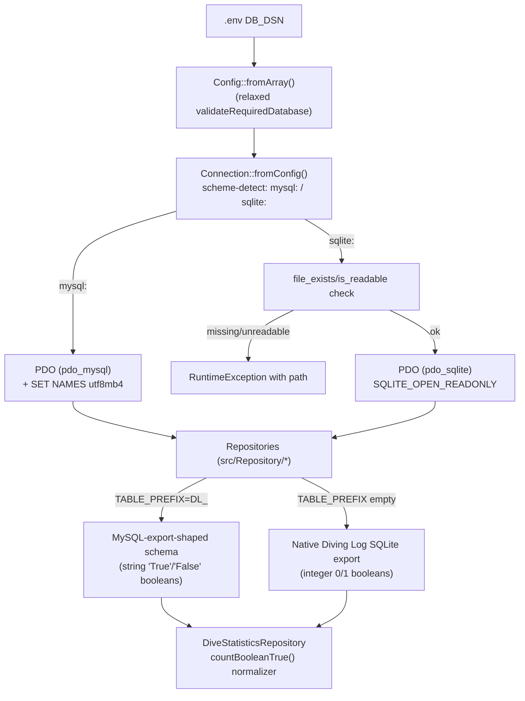

# Design Document

## Overview

Add SQLite as a fully supported alternative to MySQL for the read-only data-access layer.
The change is deliberately small: `Connection::fromConfig()` and `Config` already treat the
DSN as an opaque, engine-detected string (`Connection.php:29` already branches on
`str_starts_with(strtolower($dsn), 'mysql:')`), and the existing PHPUnit suite already runs
full repository/HTTP-smoke coverage against a SQLite fixture (`tests/fixtures/schema.sql` +
`seed.sql`, wired through `Connection::fromConfig()` exactly like production). This spec
turns that already-working test-time capability into a documented, hardened production
option, and closes the one real behavioral gap found by inspecting a genuine Diving Log
SQLite export (`divinglog-sqlite.sql`, sampled during design: SQLite 3.45 format, 214 dives,
127 places, 43 buddies, 225 pictures, unprefixed tables `Logbook`/`Place`/`Country`/`City`/
`Shop`/`Trip`/`Equipment`/`Buddy`/`Pictures`/`Tank`/`Userdefined`/`Personal`/`DBInfo`/
`Brevets`, with `Deco`/`Rep`/`DblTank` stored as SQLite `INTEGER` `0`/`1` rather than the
MySQL export's `TEXT` `'True'`/`'False'`).

## Steering Document Alignment

### Technical Standards (tech.md)
- Keeps `PDO` as the sole database abstraction — no new dependency, no query builder.
- Preserves "schema-agnostic repositories... optional columns resolved via `SELECT *` +
  case-insensitive aliases" (tech.md, Data Storage) by extending the existing fallback
  pattern rather than introducing a parallel code path.
- `TABLE_PREFIX` remains the single mechanism for schema-shape selection (tech.md: "the
  prefix mechanism also enables multi-user hosting") — an empty prefix now also doubles as
  "native Diving Log SQLite export" selection, requiring no new config key.
- Read-only contract preserved: SQLite is opened with `PDO::SQLITE_ATTR_OPEN_FLAGS =>
  PDO::SQLITE_OPEN_READONLY` (available since PHP 8.1; project targets 8.3+).

### Project Structure (structure.md)
- Connection/DSN logic stays in `src/Database/Connection.php` and `src/Support/Config.php`
  (existing files, no new top-level module).
- The boolean-column fix stays inside `src/Repository/DiveStatisticsRepository.php`, the
  file that already owns that logic.
- New test fixtures follow the existing `tests/fixtures/` convention, adding
  `native-schema.sql` + `native-seed.sql` alongside the current `schema.sql`/`seed.sql`
  rather than replacing them (the MySQL-export-shaped fixture stays the primary one).

## Code Reuse Analysis

### Existing Components to Leverage
- **`Connection::fromConfig()`**: Already branches on DSN scheme for the MySQL-only
  `SET NAMES` statement; extended with a sibling SQLite branch (file-readability check +
  read-only open flag) rather than a new class.
- **`Config::fromArray()` / `validateRequiredDatabase()` / `databaseDsn()`**: Already support
  a `DB_DSN` escape hatch that bypasses host/port/name construction; validation is loosened
  by one additional condition, no structural change.
- **`DiveRepository`'s `firstNonEmptyString()` / `firstNumeric()` fallback pattern**: The
  precedent for "same query, multiple possible export shapes" already exists in this file
  and is the template for the new boolean-normalization helper.
- **`isMissingColumn()` / missing-table `try/catch` pattern** (present in `DiveRepository`,
  `DiveStatisticsRepository`, `CertificationRepository`): Reused as-is — the native export's
  table set is a subset/superset match for most repositories already, so most call sites need
  no change at all.
- **`tests/fixtures/` + `ConnectionTest`/repository integration tests**: Existing test
  scaffolding is extended with a second fixture pair, not replaced.

### Integration Points
- **`Config` → `Connection`**: `Connection::fromConfig(Config $config)` is the single choke
  point where DSN scheme is inspected; this is where all new branching lives.
- **`adapters/web/bootstrap.php`**: No change — it already just calls
  `Connection::fromConfig($config)` and wires the resulting `PDO` into repositories.
- **`.env` / `.env.example`**: `DB_DSN=sqlite:...` plus `TABLE_PREFIX=` (empty) is the whole
  user-facing surface for switching engines/shapes — no new environment variable is added.

## Architecture



### Modular Design Principles
- **Single File Responsibility**: `Connection` owns *how* to open a PDO handle for a given
  DSN; `Config` owns *validating and shaping* the DSN from env; repositories own *what* to
  query. This split is unchanged — SQLite support slots into the existing responsibilities.
- **Component Isolation**: The boolean-normalization fix is a private method inside
  `DiveStatisticsRepository`; it does not leak an engine-detection concept into any other
  repository or into controllers/templates.
- **Service Layer Separation**: No template, controller, or API adapter code changes —
  engine choice is invisible above the repository layer, exactly as it is today for MySQL.
- **Utility Modularity**: If a second repository is later found to need the same
  string/int-boolean normalization, extract `countBooleanTrue()`'s inner predicate into a
  small shared `Support` helper at that time — not preemptively for this scope (see Non-Goals
  in requirements.md).

## Components and Interfaces

### `Config` (src/Support/Config.php)
- **Purpose:** Validate and shape environment-driven configuration, including the database
  DSN.
- **Interfaces:** `fromArray()`, `dsn()`, `databaseUser()`, `databasePassword()`,
  `tablePrefix()` — signatures unchanged.
- **Change:** `validateRequiredDatabase()` gains a third acceptance branch: a DSN that starts
  with `sqlite:` is valid on its own, without requiring `DB_USER`.
  ```php
  private static function validateRequiredDatabase(array $values): void
  {
      $hasDsn = trim($values['DB_DSN']) !== '';
      $isSqliteDsn = $hasDsn && str_starts_with(strtolower(trim($values['DB_DSN'])), 'sqlite:');
      $hasHost = trim($values['DB_HOST']) !== '';
      $hasName = trim($values['DB_NAME']) !== '';
      $hasUser = trim($values['DB_USER']) !== '';

      if ($isSqliteDsn) {
          return;
      }
      if ($hasDsn && $hasUser) {
          return;
      }
      if ($hasHost && $hasName && $hasUser) {
          return;
      }

      throw new ConfigException(/* unchanged message */);
  }
  ```
- **Dependencies:** None new.
- **Reuses:** Existing `databaseDsn()`/`fromArray()` flow untouched — `DB_DSN` already passes
  through verbatim when non-empty (`Config.php:424-426`).

### `Connection` (src/Database/Connection.php)
- **Purpose:** Turn a `Config` into a configured `PDO` handle.
- **Interfaces:** `Connection::fromConfig(Config $config): PDO` — signature unchanged.
- **Change:** Add a SQLite branch parallel to the existing MySQL branch:
  1. If `dsn()` starts with `sqlite:`, extract the file path (substring after `sqlite:`).
  2. If the path is not `''` (`:memory:`/`file::memory:` stay untouched for tests) and
     `!is_readable($path)`, throw `RuntimeException` naming the path before ever calling
     `new PDO(...)` — satisfies Requirement 1.4's "actionable error" without going through a
     generic caught `PDOException`.
  3. Pass `PDO::SQLITE_ATTR_OPEN_FLAGS => PDO::SQLITE_OPEN_READONLY` in the driver options
     array only when the DSN is a `sqlite:` DSN — satisfies Requirement 1.6.
  4. Keep the existing `str_starts_with(..., 'mysql:')` guard around `SET NAMES` unchanged
     (already correctly skips it for `sqlite:`).
- **Dependencies:** `Config`. No new dependency.
- **Reuses:** Existing try/catch → `RuntimeException('Unable to establish database
  connection.')` wrapper stays as the fallback for errors PDO itself raises (e.g. malformed
  SQLite file); the new pre-check only handles the "file missing/unreadable" case where a
  path-specific message is strictly better than PDO's generic one.

### `DiveStatisticsRepository` (src/Repository/DiveStatisticsRepository.php)
- **Purpose:** Compute aggregate dive statistics, including deco/rep/twin-tank
  classification counts.
- **Interfaces:** `compute()` — signature unchanged.
- **Change:** Replace the three literal-SQL boolean comparisons in `computeClassifications()`
  (`"Deco = 'True'"`, `"Rep = 'True'"`, `"(DblTank = 'False' OR DblTank = 'false')"`,
  `"DblTank = 'True'"`) with a new private method:
  ```php
  private function countBooleanTrue(string $column): ?int
  {
      $sql = sprintf('SELECT %1$s AS Val FROM %2$sLogbook', $column, $this->tablePrefix);
      try {
          $rows = $this->pdo->query($sql)->fetchAll();
      } catch (\PDOException $exception) {
          if ($this->isMissingColumn($exception)) {
              return null;
          }
          throw $exception;
      }
      $count = 0;
      foreach ($rows as $row) {
          if ($this->isTruthyBooleanValue($row['Val'] ?? null)) {
              $count++;
          }
      }
      return $count;
  }

  private function isTruthyBooleanValue(mixed $value): bool
  {
      if ($value === null) {
          return false;
      }
      $normalized = strtolower(trim((string) $value));
      return $normalized === 'true' || $normalized === '1';
  }
  ```
  `nodeco`/`norep`/`single` derive from `$total - count` as today; `single` becomes
  `$total - countBooleanTrue('DblTank')` when `DblTank` is not missing, matching the existing
  `nodeco`/`norep` derivation style instead of a separate false-literal query.
  This avoids **any** cross-engine SQL literal comparison (and the MySQL implicit
  string→number coercion hazard that a naive `OR column = 1` SQL predicate would introduce —
  MySQL casts non-numeric leading strings like `'True'` to `0`, so `DblTank = 0` would
  wrongly match string-shaped `'True'` rows if evaluated in SQL). Counting in PHP over a
  single fetched column is O(dives) in memory, matching the personal-logbook scale (hundreds
  of rows) called out in the Performance NFR, and keeps the query count identical (one query
  per classification, same as today).
- **Dependencies:** Unchanged (`PDO`, table prefix).
- **Reuses:** `isMissingColumn()` unchanged; `countWhere()` remains as-is for all non-boolean
  classifications (`Entry`, `Water`, `SupplyType`, `Divetype` LIKE-based codes), which are
  already plain numeric/LIKE comparisons that behave identically across engines and export
  shapes.

### Documentation (`README.md`, `INSTALL.md`, `docs/deployment.md`, `.env.example`)
- **Purpose:** Make the SQLite path discoverable and self-serve.
- **Change:** Add a "Database: MySQL or SQLite" subsection to each covering:
  - `pdo_sqlite` as an alternative to `pdo_mysql` in the extension list.
  - `DB_DSN=sqlite:/absolute/path/to/divinglog.sqlite` example, with a note to place the file
    outside `public/` (e.g. `var/divinglog.sqlite`).
  - The two supported shapes: native export (`TABLE_PREFIX=`) vs. MySQL-export-shaped SQLite
    (`TABLE_PREFIX=DL_`, unchanged default).
  - Known limitations (BLOB-embedded photos not rendered; see Non-Goals).
- **Dependencies:** None (docs only).
- **Reuses:** Existing doc structure/sections extended in place.

## Data Models

No new PHP model/DTO types. Two SQLite *table-shape* variants map onto the existing
`Dive`/`DiveSite`/etc. models via `TABLE_PREFIX`:

### Shape A — MySQL-export-shaped (existing, `TABLE_PREFIX=DL_`)
```
DL_Logbook.Deco / Rep / DblTank : TEXT  'True' | 'False'
DL_Logbook.Number               : INTEGER (primary identity used throughout)
```

### Shape B — Native Diving Log SQLite export (new, `TABLE_PREFIX=` empty)
```
Logbook.Deco / Rep / DblTank : INTEGER  1 | 0
Logbook.ID                   : INTEGER PRIMARY KEY (rowid alias)
Logbook.Number                : INTEGER (present alongside ID; used identically to Shape A)
```
Both shapes already converge on the same `Dive` DTO via `DiveRepository`'s existing
`$row['LogID'] ?? $row['ID'] ?? $row['Number']` fallback and `SELECT *` + associative-array
mapping — verified against the sampled export, which carries `Number` directly, so no new
identity-resolution code is required beyond what already exists.

## Error Handling

### Error Scenarios
1. **SQLite file path configured but file does not exist or is not readable**
   - **Handling:** `Connection::fromConfig()` checks `is_readable()` before constructing
     `PDO`, throws `RuntimeException` with the offending path in the message.
   - **User Impact:** Bootstrap fails fast with a message like `SQLite database file not
     readable: /path/to/divinglog.sqlite` instead of a generic PDO stack trace or, worse, a
     silently empty site.

2. **SQLite file exists but is not a valid SQLite database (corrupt/wrong format)**
   - **Handling:** Falls through to the existing `catch (PDOException) { throw new
     RuntimeException('Unable to establish database connection.', 0, $exception); }` —
     the original exception is chained so the root cause remains inspectable.
   - **User Impact:** Same generic-but-safe failure mode as an unreachable MySQL server today
     (no behavior regression for this edge case).

3. **A table present in one schema shape is absent in the other** (e.g. `Fish`/`FishRel` only
   in the native export and never queried; `Signature` table name collides with an unrelated
   `Signature` model concept — out of scope, not queried by any repository today)
   - **Handling:** Existing per-repository `try/catch` on `42S02`/`42S22`/"no such table"/"no
     such column" SQLSTATEs already treats this as "feature not available," returning
     `null`/`[]`/skipping the classification — unchanged.
   - **User Impact:** The dependent section (e.g. a certification list) is simply omitted;
     no error surfaces to the visitor.

4. **`Deco`/`Rep`/`DblTank` column missing entirely** (neither shape)
   - **Handling:** `countBooleanTrue()` catches the missing-column `PDOException` exactly like
     `countWhere()` does today and returns `null`, which `computeClassifications()` already
     propagates as `null` for `deco`/`nodeco`/etc.
   - **User Impact:** Statistics page omits those specific classification rows, matching
     existing behavior for any other optional column.

## Testing Strategy

### Unit Testing
- `ConnectionTest`: add cases asserting (a) a `sqlite:` DSN does not receive the `SET NAMES`
  call (already implicitly true, made explicit), (b) a `sqlite:` DSN pointing at a missing
  file throws `RuntimeException` mentioning the path, (c) `mysql:` DSNs are unaffected.
- `ConfigTest`: add a case asserting `DB_DSN=sqlite:...` with empty `DB_USER`/`DB_PASSWORD`
  passes `validateRequiredDatabase()` and round-trips through `dsn()` unchanged.
- New `DiveStatisticsRepositoryTest` cases (or extend existing) asserting
  `countBooleanTrue()`/`isTruthyBooleanValue()` classify `'True'`, `'true'`, `1`, `'1'` as
  true and `'False'`, `0`, `null`, `''` as false.

### Integration Testing
- New fixture pair `tests/fixtures/native-schema.sql` + `tests/fixtures/native-seed.sql`,
  modeled on the real export's unprefixed table/column shape (synthetic sample data only —
  the user's actual `divinglog-sqlite.sql` is not committed), with `Deco`/`Rep`/`DblTank` as
  `INTEGER 0/1`.
- Extend the repository integration test base (or add a parallel test class) that boots a
  second in-memory/temp-file SQLite connection from the native fixture with
  `TABLE_PREFIX=''` and re-runs the key repository assertions already covered for the
  `DL_`-prefixed fixture: dive listing/detail, statistics classification counts, and
  place/trip/shop/equipment lookups.

### End-to-End Testing
- Extend the existing HTTP smoke test (`tests/Http/WebSmokeTest.php`, currently backed by
  `tests/fixtures/http-smoke.sqlite`) with a second smoke run — or a second fixture swapped
  into the same test — booted against the native-shape fixture with `TABLE_PREFIX=''`,
  asserting the dive list, dive detail, and statistics pages return 200 with no fatal errors,
  mirroring the coverage the existing smoke test already provides for Shape A.
